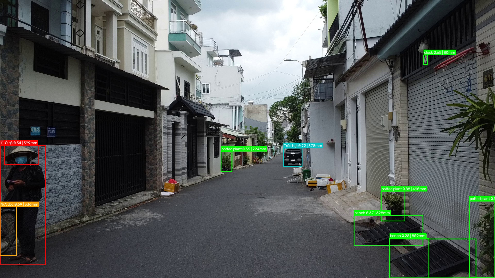
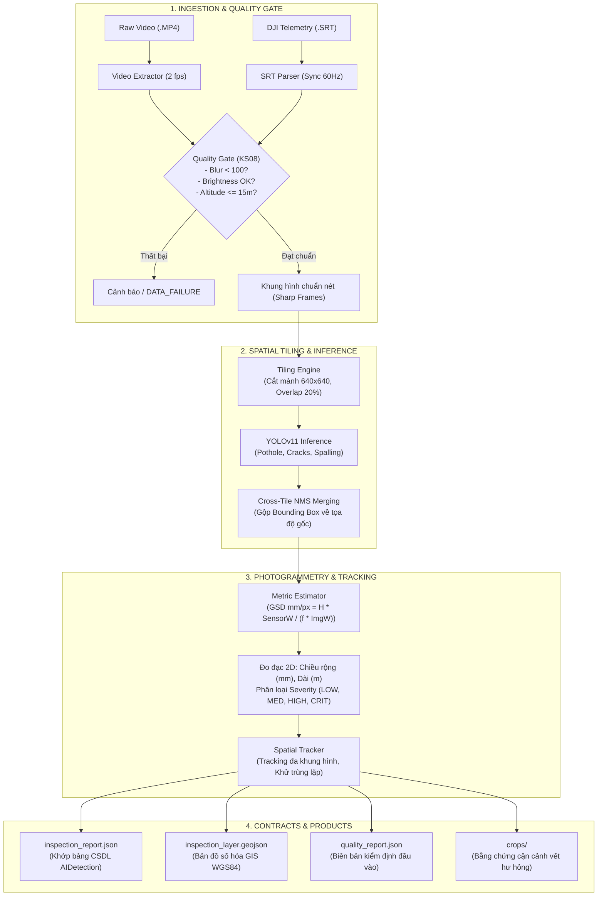

<div align="center">

# 🛣️ RoadGuard AI Engine
### Hệ Thống Thị Giác Máy Tính Khảo Sát & Đo Đạc Khuyết Tật Cầu Đường Nông Thôn Qua Video Drone (UAV)

[](https://www.python.org/)
[](https://pytorch.org/)
[](https://github.com/ultralytics/ultralytics)
[](https://www.dji.com)
[](https://geojson.org/)
[]()
[]()

<p align="center">
  <b>Tự động hóa toàn trình: Video Flycam Thô ➔ Lọc Rung Mờ ➔ Cắt Lưới Tile 640x640 ➔ Nhận Diện YOLO ➔ Đo Kích Thước Thực (GSD mm) ➔ Bản Đồ Số Hóa GIS</b>
</p>

---

</div>

## 📸 Demo Trực Quan (Detection & Real-world 2D Measurement)

> Khung hình trích xuất từ chuyến bay thực địa Drone DJI Mini 2 SE, chạy qua lưới Tile không gian và tự động đo bề rộng khuyết tật theo milimét (mm):

<div align="center">
  
  <p><i>Ảnh 1: Nhận diện khuyết tật, phân loại mức độ nghiêm trọng và tự động quy đổi kích thước thực tế (mm) theo độ cao viễn thám.</i></p>
</div>

<br/>

<div align="center">
  
  <p><i>Ảnh 2: Tự động trích xuất bằng chứng cận cảnh (Crop Evidence) độ phân giải gốc phục vụ thanh tra & nghiệm thu CSDL Backend.</i></p>
</div>

---

## 🎯 Giá Trị Cốt Lõi Của Dự Án (Core Mission)

Kiểm định hư hỏng cầu đường tại Việt Nam hiện nay chủ yếu dựa vào **đi bộ đo thủ công bằng thước cơ học** (tốn kém nhân lực, nguy hiểm giao thông) hoặc các xe quét laser LiDAR chuyên dụng trị giá hàng chục tỷ đồng.

**RoadGuard AI Engine** giải quyết triệt để bài toán này bằng cách kết hợp:
1. **Drone Dân Dụng Chi Phí Thấp (DJI Mini 2 SE)**: Bay quét nhanh toàn tuyến đường nông thôn.
2. **Kỹ Thuật Cắt Lưới Không Gian (Spatial Tiling 640x640 - Overlap 20%)**: Giải quyết triệt để vấn đề mất chi tiết của các vết nứt siêu nhỏ ($< 2\text{mm}$) khi nén ảnh $2.7\text{K}/4\text{K}$ về kích thước tiêu chuẩn YOLO.
3. **Quang Học Viễn Thám (Photogrammetry GSD Engine)**: Tự động bóc tách độ cao bay thực ($H$), góc nghiêng Gimbal ($\theta$) từ dòng phụ đề `.SRT` để tính toán chính xác kích thước thực tế ($\text{mm}, \text{m}$) mà **không cần gắn thước đo tại hiện trường**.
4. **Hợp Đồng CSDL Bất Biến (Strict Contract)**: Dữ liệu đầu ra khớp 100% Data Dictionary bảng `AIDetection` của hệ thống Backend ASP.NET Core và lớp bản đồ số hóa Leaflet/GIS (`GeoJSON FeatureCollection`).

---

## 🏗️ Kiến Trúc Hệ Thống Toàn Trình (Pipeline Workflow)



---

## 📂 Cấu Trúc Thư Mục Chuẩn Hóa (Modular 5-Layer Layout)

```
roadguard-ai-engine/
├── ⚙️ configs/                              # Cấu hình Dataset & Siêu tham số huấn luyện
│   ├── pothole_dataset.yaml                # Cấu hình tập dữ liệu Ổ gà (Roboflow)
│   └── crack_8classes.yaml                 # Cấu hình 8 nhóm khuyết tật RoadGuard
│
├── 🧠 src/                                  # MÃ NGUỒN CỐT LÕI (5 TẦNG KIẾN TRÚC ĐỘC LẬP)
│   ├── ingestion/                          # [TẦNG 1] Xử lý dữ liệu thô & Viễn thám
│   │   ├── video_extractor.py              # Trích xuất khung hình (2fps) & Lọc rung mờ (Laplacian)
│   │   ├── srt_parser.py                   # Bóc tách GPS, độ cao bay, tính GSD thời gian thực
│   │   └── raw_video_analyzer.py           # Bộ kiểm định Quality Gate & Phân tích tổng hợp
│   │
│   ├── inference/                          # [TẦNG 2 & 3] Suy luận thị giác & Cắt mảnh
│   │   ├── tiling_engine.py                # Cắt mảnh 640x640 gối đầu 20% & Cross-tile NMS
│   │   └── predictor.py                    # RoadDefectPredictor bọc mô hình YOLO & Vẽ trực quan
│   │
│   ├── measurement/                        # [TẦNG 4] Trắc địa quang học & Tracking
│   │   ├── metric_estimator.py             # Tính kích thước mm, m từ GSD & Xếp loại Severity
│   │   └── spatial_tracker.py              # Khử trùng lặp qua các khung hình liên tiếp
│   │
│   ├── contracts/                          # [TẦNG 5] Tích hợp Backend & Định dạng chuẩn
│   │   ├── aidetection_schema.py           # Chuẩn hóa Payload bảng AIDetection & Xuất GeoJSON
│   │   └── mock_ai_adapter.py              # Bộ giả lập sinh dữ liệu phục vụ test Backend sớm
│   │
│   └── training/                           # Huấn luyện mô hình
│       ├── train_pothole.py                # Script train Pothole cục bộ
│       └── train_crack.py                  # Script train mở rộng đa khuyết tật
│
├── 🚀 process_raw_video.py                  # CLI TOOL ĐẦU NÃO: Xử lý video thô từ Backend
├── 🚀 pipeline.py                           # Master Pipeline Runner tổng hợp
│
├── 📓 notebooks/                            # Huấn luyện Cloud GPU (Kaggle / Google Colab T4)
│   └── train_pothole_colab_kaggle.ipynb
│
├── ⚖️ weights/                              # Quản lý phiên bản trọng số mô hình
│   ├── base/best.pt                        # Base weights khởi tạo (YOLOv11n)
│   └── trained/                            # Trọng số sau huấn luyện chuyên sâu
│
├── 📦 data/                                 # Dữ liệu hình ảnh kiểm thử & huấn luyện
│   └── pothole/                            # 3,940 ảnh (Train, Valid, Test)
│
├── 📚 docs/                                 # Toàn bộ tài liệu nghiệp vụ, kiến trúc & tiến độ
│   ├── tiến_độ.md                         # BẢNG THEO DÕI TIẾN ĐỘ & AGENT RULE (BẮT BUỘC)
│   ├── ke_hoach_thuc_thi_AI.md            # Kế hoạch thực thi chi tiết 6 Epics
│   ├── AI_task.md                         # Đặc tả kỹ thuật chi tiết nhóm AI
│   └── specs/                             # 5 bộ hồ sơ đặc tả nguyên bản RoadGuard
│
├── 🧪 tests/                                # Kiểm thử tự động (Unit Tests)
│   └── test_pipeline.py                    # Suite 6 tests kiểm tra GSD, Tiling, GeoJSON,...
│
├── 📄 requirements.txt                      # Danh mục thư viện phụ thuộc
└── 📄 antigravity_prompt.md                 # Chỉ dẫn cốt lõi cho AI Coding Agent
```

---

## ⚡ Bắt Đầu Nhanh (Quickstart Guide)

### 1. Cài đặt môi trường
Khuyến nghị sử dụng Python 3.10 trở lên:
```bash
# Tạo và kích hoạt môi trường ảo
python -m venv venv
.\venv\Scripts\activate      # Trên Windows
source venv/bin/activate     # Trên Linux/macOS

# Cài đặt thư viện phụ thuộc
pip install -r requirements.txt
```

### 2. Chạy kiểm thử tự động (Verify Pipeline)
Chạy bộ kiểm thử toàn diện để đảm bảo mọi công thức GSD, Tiling, GeoJSON đều chính xác 100%:
```bash
python tests/test_pipeline.py
```
> Kết quả mong đợi: `Ran 6 tests in 0.003s - OK`

---

## 🛠️ Hướng Dẫn Vận Hành Các Kịch Bản Thực Tế

### 🎬 Kịch bản 1: Phân tích Video Flycam Thô (Real Drone Footage)
Chạy phân tích trực tiếp video `.MP4` (kèm file viễn thám `.SRT` nếu có):
```bash
python process_raw_video.py \
  --video "F:\Fake_admin\Downloads\đồ án test vid\DJI_0057.MP4" \
  --output "results/run_dji_0057" \
  --sample-rate 30 \
  --max-frames 50
```
**Các tham số quan trọng:**
* `--video`: Đường dẫn tệp video cần phân tích.
* `--srt`: Đường dẫn tệp phụ đề viễn thám DJI (tuỳ chọn, tự động fallback an toàn nếu không có).
* `--sample-rate`: Bước nhảy trích xuất khung hình (VD: `30` ứng với ~2 khung hình/giây cho video 60fps).
* `--max-frames`: Giới hạn khung hình kiểm thử nhanh (bỏ cờ này để chạy toàn bộ video).
* `--conf`: Ngưỡng tin cậy nhận diện (mặc định: `0.25`).

### 🔍 Kịch bản 2: Chỉ kiểm tra chất lượng video (Quality Gate Audit)
Đánh giá độ rung mờ, thiếu sáng trước khi tốn tài nguyên chạy mô hình AI:
```bash
python process_raw_video.py \
  --video "data/sample.mp4" \
  --quality-check-only
```

### 🤖 Kịch bản 3: Chạy giả lập để Backend ASP.NET Core test API
Sinh bộ báo cáo mẫu chuẩn 100% CSDL Backend trong $< 0.1$ giây:
```bash
python pipeline.py --mock --output results/mock_run
```

---

## 📋 Cấu Trúc Dữ Liệu Đầu Ra (Output Artifacts)

Mỗi lần chạy sẽ tự động xuất một gói nghiệm thu hoàn chỉnh:

```
results/run_dji_0057/
├── quality_report.json       # Biên bản thẩm định độ rung mờ, ánh sáng, độ cao bay
├── inspection_report.json    # Báo cáo CSDL khớp bảng AIDetection
├── inspection_layer.geojson  # Tọa độ GIS WGS84 cho bản đồ Leaflet.js
├── visualizations/           # Ảnh toàn cảnh vẽ Bounding Box + Kích thước (mm)
└── crops/                    # Ảnh chụp cận cảnh từng vết nứt/ổ gà độ nét gốc
```

#### Trích đoạn `inspection_report.json` (Khớp 100% CSDL Backend `AIDetection`):
```json
{
  "processing_job_id": "job-680e48fb2bd5",
  "status": "COMPLETED",
  "total_detections": 185,
  "detections": [
    {
      "id": "662feb45-35c1-4665-a3ca-346d874e4261",
      "defect_type_code": "POTHOLE",
      "confidence": 0.9146,
      "is_2d_estimate": true,
      "estimated_width": 399.5,
      "estimated_length": 0.420,
      "severity": "HIGH",
      "defect_location_method": "OBSERVED_FOOTPRINT",
      "camera_pose_json": {
        "altitude_m": 10.0,
        "gimbal_pitch": -90.0,
        "gsd_mm_per_px": 5.32
      },
      "raw_payload": {
        "crop_artifact_uri": "crops/crop_job-680e48fb2bd5_0001.jpg"
      }
    }
  ]
}
```

---

## 🛑 NGUYÊN TẮC VÀNG CHO AI AGENT & DEVELOPER (MANDATORY AGENT RULE)

> ⚠️ **BẮT BUỘC TUÂN THỦ TRƯỚC VÀ SAU MỖI PHIÊN LÀM VIỆC:**

1. **Trước khi bắt tay code (Pre-session):**
   * Mở và đọc kỹ file [`tiến độ.md`](file:///f:/train%20AI%20đồ%20án/tiến%20độ.md) để nắm trạng thái công việc hiện tại.
   * Tra cứu đối chiếu nhiệm vụ trong [`docs/ke_hoach_thuc_thi_AI.md`](file:///f:/train%20AI%20đồ%20án/docs/ke_hoach_thuc_thi_AI.md) để hiểu rõ ràng bối cảnh, lý do (Why) và ràng buộc kỹ thuật.
2. **Trong khi thực hiện thay đổi (In-session):**
   * Tuân thủ kiến trúc phân tầng trong thư mục `src/`, không tạo file rời rạc ngoài thư mục gốc.
   * **Bất biến miền (Domain Invariants):** Tuyệt đối KHÔNG giả lập chiều sâu 3D (Z) khi chỉ có ảnh 2D RGB đơn; KHÔNG gộp tọa độ GPS máy bay với tọa độ chân vết nứt dưới đất (`aircraft_location` $\neq$ `geometry`).
3. **Sau khi hoàn thành (Post-session):**
   * Chạy lại `python tests/test_pipeline.py` đảm bảo không làm gãy các module khác.
   * Cập nhật checklist và ghi chú chi tiết vào phần **Nhật ký thay đổi (Changelog)** trong [`tiến độ.md`](file:///f:/train%20AI%20đồ%20án/tiến%20độ.md).

---

## 👥 Nhóm Tác Giả & Bản Quyền
- **Dự án:** RoadGuard / CrackScan VN — Đồ Án Tốt Nghiệp Hệ Thống Khảo Sát Hư Hỏng Đường Nông Thôn.
- **Giấy phép:** MIT License. Mọi đóng góp xin vui lòng tạo Pull Request hoặc liên hệ qua Issue tracker.
