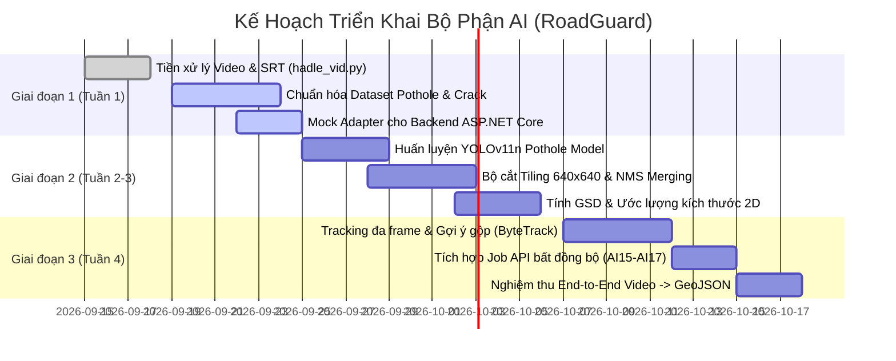

# 🤖 RoadGuard — Đặc Tả Chi Tiết Nhiệm Vụ Kỹ Thuật Bộ Phận AI (AI Tasks Specification)
> **Tài liệu tham chiếu:** Đồng bộ từ `Dac_ta_UseCase_v2.md`, `RoadGuard_Data_Dictionary_v1.md`, `RoadGuard_Domain_Model_v1.md`, `RoadGuard_ERD_v1.md` và `User_Stories_Acceptance_Criteria_v2.md`.  
> **Phạm vi áp dụng:** Đội ngũ Kỹ sư AI/ML & Computer Vision chịu trách nhiệm phát triển **Dịch vụ Phân tích AI bên ngoài (External AI Service / AI Worker Engine)** cho hệ thống RoadGuard.

---

## 1. Tổng Quan & Ranh Giới Hệ Thống (System Boundaries & Context)

Theo kiến trúc hệ thống RoadGuard và nguyên tắc **ADR 003**:
- **Backend (ASP.NET Core + SQL Server Spatial):** Quản lý nghiệp vụ chính, lưu trữ bền vững manifest, điều phối `ProcessingJob`, quản lý trạng thái hư hỏng (`Defect`), phân công đội sửa chữa và phê duyệt chi phí.
- **Frontend (Android Mobile App & Web Dashboard):** Giao diện cho Drone Operator (nạp video, kiểm tra chất lượng tại hiện trường), PM (rà soát sơ bộ, xác minh, lập đợt sửa) và Supervisor (thẩm định toàn bộ đợt sửa).
- **Bộ phận AI (External AI Service / AI Worker Engine):** Chạy độc lập ngoài vòng đời request HTTP của người dùng, giao tiếp bất đồng bộ qua Message Queue / Background Job API. Nhận đầu vào là **`ProcessingInputManifest`**, thực thi bóc tách hình ảnh, định vị không gian, nhận diện khuyết tật mặt đường và trả về danh sách **`AIDetection`** thô (immutable raw payload) đạt chuẩn hợp đồng dữ liệu.

```
┌─────────────────────────────────────────────────────────────────────────┐
│                           HỆ THỐNG ROADGUARD                            │
└────────────────────────────────────┬────────────────────────────────────┘
                                     │
         ┌───────────────────────────┴───────────────────────────┐
         ▼                                                       ▼
┌─────────────────────────────────┐             ┌─────────────────────────────────┐
│      BACKEND ASP.NET CORE       │             │   BỘ PHẬN AI (AI SERVICE ENGINE)│
│  - SurveyDataVersion Manager    │             │  - DJI SRT Telemetry & GSD Sync │
│  - ProcessingBlock Partition    │             │  - Frame Blur & Quality Filter  │
│  - ProcessingJob & Manifest     │ ──(Job /)──>│  - Dynamic Tiling 640x640 Grid  │
│  - Defect Lifecycle (OPEN...)   │ <─(Result)──│  - YOLOv11 Detect/Seg Inference │
│  - Audit & Verification Log     │             │  - Tile NMS & Cross-frame Track │
│  - Training Label Approval      │             │  - 2D Metric (Width/Length) mm  │
└─────────────────────────────────┘             └─────────────────────────────────┘
```

---

## 2. Ma Trận Truy Vết Use Cases Dành Riêng Cho Bộ Phận AI

| Mã Use Case | Mã User Story | Tên chức năng | Trách nhiệm cụ thể của Bộ phận AI |
|:---|:---|:---|:---|
| **KS08** | US-06 | Kiểm tra chất lượng dữ liệu khảo sát | Module lọc mờ (Laplacian Variance), kiểm tra độ phủ, phơi sáng, phát hiện mất tín hiệu GPS/SRT. |
| **KS10** | US-06 | Tiến độ xử lý phân tích AI | Cung cấp webhook/polling status (`QUEUED`, `RUNNING`, `COMPLETED`, `FAILED`) và % tiến độ. |
| **AI01** | US-08 | Kết quả phân tích trên bản đồ & ảnh | Xuất tọa độ BBox, Polygon mask, nhãn hư hỏng, điểm số tin cậy (confidence) và crop bằng chứng. |
| **AI02 - AI03** | US-08 / RS | Đo đạc 2D & Phân biệt đo thực địa | Tính kích thước 2D ước lượng (`estimated_width`, `estimated_length`, GSD). **Bắt buộc gắn cờ `is_2d_estimate = true`**. |
| **AI08** | US-09 | Đối chiếu phát hiện trùng một hư hỏng | Thuật toán Spatial Tracking đề xuất các quan sát trùng (`DefectObservation`). **AI chỉ gợi ý, PM quyết định**. |
| **AI14** | US-10 | Duyệt nhãn phục vụ huấn luyện | Tiếp nhận các `TrainingLabelApproval` đã được PM duyệt để đưa vào pipeline tái huấn luyện (Active Learning). |
| **AI15** | US-26 | Phân tích bất đồng bộ theo Block | Xử lý theo `ProcessingBlock` (phân định `SURFACE`, `LEFT_EDGE`, `RIGHT_EDGE`) và `ProcessingInputManifest`. |
| **AI16** | US-26 | Nhận kết quả an toàn, Idempotency | Tính toán Checksum, Idempotency Key, chống nhân đôi detection khi retry, phân biệt lỗi Hạ tầng vs Lỗi Dữ liệu. |
| **AI17** | US-26 | Ngữ cảnh biên (Context Overlap) | Xử lý vùng chồng lấn biên giữa các segment/block (20% overlap), tránh cắt đứt vết nứt nằm ở ranh giới. |
| **QT06 - QT07**| US-18 | Quản trị mô hình AI & Nhãn | Quản lý phiên bản mô hình `AIModelVersion`, ghi nhận metrics (mAP50, Precision, Recall) và operating thresholds. |

---

## 3. Danh Mục Chi Tiết Các Nhiệm Vụ Kỹ Thuật (AI Engineering Tasks)

### 📌 EPIC 1: Data Ingestion, Telemetry Sync & Quality Gate (Tiền Xử Lý Khảo Sát)
*Mục tiêu: Đảm bảo dữ liệu video Flycam thô được làm sạch, đồng bộ hóa chính xác với tọa độ không gian trước khi đưa vào mô hình học sâu.*

- [ ] **Task 1.1: Trích xuất Frame & Lấy mẫu thời gian (Frame Sampling Engine)**
  - Nhận video 2.7K ($2720 \times 1530$) hoặc 4K @ 30fps từ DJI Mini 2 SE.
  - Lấy mẫu thích ứng: Mặc định $2\text{ fps}$ (1 frame mỗi 15 frame video), đảm bảo độ phủ gối đầu $\ge 60\%$ theo vận tốc bay $3 - 5\text{ m/s}$.
  - Gắn nhãn `frame_index`, `timestamp_ms` bất biến cho từng frame xuất xưởng.
- [ ] **Task 1.2: Bộ lọc phát hiện nhòe mờ & Rung lắc (Blur Detection - KS08)**
  - Áp dụng thuật toán biến sai Laplacian (Laplacian Variance Threshold):
    $$\text{Var}(\Delta I) < 100.0 \implies \text{Đánh dấu BLUR (Mờ) } \rightarrow \text{ Skip frame}$$
  - Đếm tỷ lệ frame lỗi. Nếu một phân đoạn có $> 30\%$ frame bị mờ/tối, phát cờ cảnh báo `DATA_FAILURE: LOW_QUALITY_FRAMES` về Backend để PM yêu cầu bay bổ sung (KS11).
- [ ] **Task 1.3: Parser định vị DJI SRT & Tính toán GSD thời gian thực (Telemetry Sync)**
  - Đọc luồng phụ đề hoặc file rời `.SRT`, bóc tách chu kỳ $33\text{ ms}$:
    - Tọa độ thiết bị: `Latitude`, `Longitude`, `Altitude` (độ cao tương đối so với điểm cất cánh).
    - Góc nghiêng Gimbal: `Gimbal Pitch`, `Roll`, `Yaw`.
  - Thuật toán tính GSD (Ground Sampling Distance) thời gian thực theo thông số cảm biến DJI Mini 2 SE:
    $$\text{GSD} = \frac{\text{Altitude (m)} \times 1000 \times 6.17\text{ mm}}{4.26\text{ mm} \times 2720\text{ px}} \quad (\text{mm/pixel})$$
  - Ràng buộc an toàn: Nếu $\text{Altitude} > 20\text{ m}$ (GSD $> 2.86\text{ mm/px}$), phát sinh cảnh báo suy giảm độ chính xác nhận diện vết nứt mảnh.

---

### 📌 EPIC 2: Model Architecture, Training & Active Learning (Mô Hình AI)
*Mục tiêu: Xây dựng, huấn luyện và tối ưu hóa mạng nơ-ron nhận diện chính xác các loại hư hỏng mặt đường bê-tông nông thôn.*

- [ ] **Task 2.1: Chuẩn hóa Dataset & Định dạng 8 Classes Mục Tiêu**
  - Đồng bộ hóa các nguồn dữ liệu (Roboflow Pothole 3,940 ảnh, RDD2022, CRACK500, ảnh Flycam thực tế) về định dạng chuẩn YOLO Segmentation/Detection.
  - Ánh xạ nghiêm ngặt theo bảng mã `DefectType.code` của hệ thống:
    1. `pothole`: Ổ gà, hố sụt mặt đường (Ưu tiên mức độ nghiêm trọng `CRITICAL`).
    2. `longitudinal_crack`: Vết nứt dọc tim đường hoặc vệt bánh xe.
    3. `transverse_crack`: Vết nứt ngang đường/cầu.
    4. `alligator_crack`: Nứt chân chim, mai rùa liên hoàn.
    5. `edge_crack`: Nứt gãy mép lề đường, sạt lở rìa bê-tông.
    6. `block_crack`: Nứt dạng lưới ô bàn cờ.
    7. `spalling`: Bong tróc vỡ lớp bê-tông bề mặt trơ cốt thép.
    8. `raveling`: Rỗ bề mặt, bong tróc cốt liệu đá dăm.
- [ ] **Task 2.2: Huấn luyện Transfer Learning (Base weights `best.pt`)**
  - Sử dụng kiến trúc `YOLOv11n` / `YOLOv11n-seg` tối ưu cho biên tính toán (Edge/Lightweight).
  - Tận dụng `best.pt` làm pretrained base weights để tăng tốc hội tụ.
  - Cấu hình siêu tham số (Hyperparameters) tối ưu cho góc nhìn từ trên không (Top-down Nadir Drone View):
    - `degrees: 45.0`, `flipud: 0.5`, `fliplr: 0.5` (góc nhìn thẳng đứng xoay mọi hướng).
    - `scale: 0.5` (mô phỏng biến thiên độ cao bay 5m - 15m).
    - `hsv_v: 0.5` (thích nghi nắng gắt / bóng râm nông thôn miền Nam).
- [ ] **Task 2.3: Quản lý Phiên bản Mô hình (AIModelVersion Registry - QT06)**
  - Tự động đóng gói checkpoint xuất xưởng kèm manifest:
    - `version_label`: Ví dụ `yolo11n-crack-v1.0.0`
    - `metrics`: Đạt $\text{mAP50} \ge 0.65$ trên tập Validation, Precision, Recall từng class.
    - `operating_thresholds`: `conf_threshold = 0.35`, `iou_threshold = 0.45`.
  - **Quy tắc bất biến:** Không bao giờ cascade update phiên bản mô hình lên các bản ghi `AIDetection` cũ trong database.
- [ ] **Task 2.4: Đường ống Tái huấn luyện Chủ động (Active Learning Pipeline - AI14, QT07)**
  - Tiếp nhận tệp JSON từ `TrainingDatasetExport` (gồm các mẫu lỗi do PM đã chỉnh sửa nhãn và duyệt `TrainingLabelApproval`).
  - Tự động bổ sung vào tập `train/` và `valid/`, chạy script fine-tune chu kỳ định kỳ.

---

### 📌 EPIC 3: Inference Engine & Spatial Tiling (Động Cơ Nhận Diện Phân Tích)
*Mục tiêu: Đảm bảo các vết nứt nhỏ chỉ vài milimet không bị mất khi đưa vào mạng nơ-ron và ghép nối toàn vẹn không gian.*

- [ ] **Task 3.1: Bộ cắt mảnh không gian (Dynamic Slicing / Tiling Engine)**
  - Khung hình Flycam $2720 \times 1530$ nếu resize trực tiếp về $640 \times 640$ sẽ làm tiêu biến các vết nứt mảnh.
  - Cắt lưới đa tile kích thước $640 \times 640$ với độ chồng lấn **$20\%$ (Overlap)** giữa các tile kề nhau.
  - Lưu trữ ma trận biến đổi tọa độ gốc: $\text{Tile}(x_t, y_t) \rightarrow \text{Frame}(X, Y)$.
- [ ] **Task 3.2: Khử trùng lặp giữa các Tile (Tile NMS Merging)**
  - Chạy mô hình YOLO trên từng tile $640 \times 640$.
  - Chiếu ngược các bounding box/polygon về hệ tọa độ gốc $2720 \times 1530$.
  - Áp dụng Non-Maximum Suppression (NMS) xuyên tile để triệt tiêu các box bị phát hiện lặp lại ở dải overlap $20\%$.
- [ ] **Task 3.3: Phân vùng phân tích theo dải mục tiêu (Target Bands & Context Overlap - AI15, AI17, US-26)**
  - Hỗ trợ xử lý theo cấu hình `target_band` từ `ProcessingBlock`:
    - `SURFACE`: Toàn bộ phần lòng đường xe chạy.
    - `LEFT_EDGE`: Dải biên mép đường bên trái (phát hiện xói lở lề, nứt mép).
    - `RIGHT_EDGE`: Dải biên mép đường bên phải.
  - Xử lý dải đệm biên giữa các block/segment (Context Overlap): Mở rộng phạm vi quét thêm $10 - 15\%$ qua ranh giới segment liền kề để không làm đứt đoạn vết nứt chạy dài qua 2 segment.

---

### 📌 EPIC 4: Metric Estimation & Spatial Tracking (Đo Đạc 2D & Theo Dõi)
*Mục tiêu: Quy đổi kích thước pixel ra kích thước thực tế và khử trùng lặp đối tượng qua các khung hình liên tiếp.*

- [ ] **Task 4.1: Tính toán Kích thước Vật lý 2D Ước lượng (AI03)**
  - Với mỗi bounding box / polygon mask của khuyết tật:
    $$\text{Width (mm)} = \text{Pixel Width} \times \text{GSD}$$
    $$\text{Length (m)} = \frac{\text{Pixel Length} \times \text{GSD}}{1000}$$
  - Phân loại mức độ nghiêm trọng sơ bộ (`severity`):
    - `LOW`: Nứt rạn chân chim, bề rộng $< 2\text{ mm}$.
    - `MEDIUM`: Nứt bề rộng $2 - 5\text{ mm}$.
    - `HIGH`: Nứt sâu $> 5\text{ mm}$, bong tróc bê-tông (`spalling`).
    - `CRITICAL`: Ổ gà (`pothole`), sụt lún mép đường ảnh hưởng an toàn giao thông.
  - **Ràng buộc Domain Model:** Bắt buộc gắn cờ `is_2d_estimate = true`. Không được tuyên bố đây là số đo thực địa tuyệt đối (Ground Truth).
- [ ] **Task 4.2: Phép chiếu tọa độ địa lý & Định vị (Defect Georeferencing)**
  - Ghi nhận `aircraft_location`: Tọa độ GPS của Drone tại thời điểm quay frame.
  - Trường `geometry`: Tính toán tọa độ tâm của vết nứt dựa trên GPS Drone + Góc nghiêng Gimbal + Độ cao bay (Ray casting / Direct Georeferencing xuống mặt đất phẳng WGS84).
  - Gán nhãn `defect_location_method`:
    - `OBSERVED_FOOTPRINT`: Khi tính từ footprint ảnh và độ cao bay.
    - `PROJECTED_STATION`: Khi đã chiếu vuông góc lên tim tuyến đường.
    - `UNKNOWN`: Khi thiếu thông số góc nghiêng Gimbal hoặc độ cao bay không tin cậy.
    - *(Nghiêm cấm lấy thẳng GPS Drone gán làm GPS của vết nứt nếu chưa có phép chiếu).*
- [ ] **Task 4.3: Tracking đa khung hình & Khử trùng lặp đối tượng (Frame-to-Frame Tracking - AI08)**
  - Do drone bay liên tục, một ổ gà sẽ xuất hiện trên 3–6 frame kế tiếp nhau.
  - Ứng dụng thuật toán **ByteTrack / Kalman Filter kết hợp GPS Motion Compensation**:
    - Dự đoán vị trí tương đối giữa các frame dựa theo vector vận tốc bay.
    - So khớp không gian (Spatial Distance $< 1.5\text{ m}$ và IoU $> 0.3$).
  - Gom các detection cùng đối tượng thành cụm, đề xuất các quan sát con (`DefectObservation`).
  - **Nguyên tắc Invariant:** AI chỉ **đề xuất gộp**. Quyết định gộp chính thức thuộc thẩm quyền của PM (`AI08`).

---

### 📌 EPIC 5: Contract Standardization & Integration (Hợp Đồng Dữ Liệu & Tích Hợp)
*Mục tiêu: Đảm bảo giao tiếp API bất đồng bộ với Backend ASP.NET Core mượt mà, chịu lỗi và có thể kiểm thử độc lập.*

- [ ] **Task 5.1: Xây dựng Payload Output Chuẩn Hóa (`AIDetection` Contract - AI16)**
  - Chuẩn hóa JSON schema trả về cho Backend:
  ```json
  {
    "job_id": "9b1deb4d-3b7d-4bad-9bdd-2b0d7b3dcb6d",
    "model_version_id": "c3b9e4a1-1234-5678-abcd-000000000001",
    "status": "COMPLETED",
    "execution_time_seconds": 12.45,
    "detections": [
      {
        "id": "f47ac10b-58cc-4372-a567-0e02b2c3d479",
        "defect_type_code": "pothole",
        "confidence": 0.8950,
        "is_2d_estimate": true,
        "estimated_width_mm": 320.5,
        "estimated_length_m": 0.45,
        "defect_location_method": "OBSERVED_FOOTPRINT",
        "geometry_wkt": "POINT(106.660172 10.762622)",
        "aircraft_location_wkt": "POINT(106.660168 10.762615)",
        "location_uncertainty_m": 1.25,
        "camera_pose_json": {
          "altitude_m": 8.4,
          "gimbal_pitch_deg": -89.5,
          "gsd_mm_per_px": 1.20,
          "frame_index": 142,
          "timestamp_ms": 71000
        },
        "raw_payload": {
          "bbox_xywh_normalized": [0.452, 0.512, 0.125, 0.088],
          "polygon_normalized": [[0.452, 0.512], [0.477, 0.515], [0.485, 0.600]],
          "crop_image_artifact_uri": "artifacts/crops/job_9b1/det_f47.jpg"
        }
      }
    ]
  }
  ```
- [ ] **Task 5.2: Cơ chế Idempotency & Quản lý Thử lại (Retry & Deduplication - AI16, US-26)**
  - Khóa trùng lặp `idempotency_key = MD5(ProcessingBlockId + ModelVersionId + InputChecksum)`.
  - Nếu Backend gọi lại với cùng key $\rightarrow$ Trả kết quả cũ ngay lập tức, không chạy lại GPU tốn tài nguyên.
  - Phân loại lỗi trả về chuẩn xác:
    - `INFRASTRUCTURE_ERROR`: GPU OOM, worker timeout $\rightarrow$ Cho phép Backend retry có exponential backoff.
    - `DATA_ERROR`: Video hỏng, mất file SRT, ảnh quá mờ $\rightarrow$ Chuyển PM quyết định bay bổ sung (không vô vọng retry).
- [ ] **Task 5.3: Xây dựng Mock Adapter (Phục vụ Backend nghiệm thu sớm)**
  - Viết module giả lập (Mock AI Engine) theo đúng hợp đồng dữ liệu trên:
    - Có cờ gắn nhãn `is_mock = true`.
    - Sinh dữ liệu giả lập có tọa độ hợp lệ trên tim tuyến đường kiểm thử để Backend ASP.NET Core nghiệm thu luồng nghiệp vụ trước khi cắm GPU AI thật.

---

## 4. Các Quy Tắc Bất Biến Nghiêm Ngặt (AI Domain Invariants)

Kỹ sư AI **tuyệt đối không được vi phạm** các quy tắc miền nghiệp vụ sau:

1. **Bất biến kết quả thô (`AIDetection` is Immutable):** Sau khi AI Service trả kết quả về Backend và ghi vào CSDL, bản ghi `AIDetection` không bao giờ được phép sửa đổi hoặc xóa mềm. Mọi thao tác hiệu chỉnh của con người (PM) đều ghi vào bản ghi `DefectVerificationLog`.
2. **Không tự động tạo `Defect VERIFIED`:** Kết quả AI chỉ sinh ra `AIDetection`. Khi PM giữ lại, trạng thái của `Defect` là `OPEN` (Preliminary Defect). Chỉ sau khi kiểm chứng hoặc đo thực tế đạt yêu cầu, PM mới được chuyển sang `VERIFIED`.
3. **Không lấy GPS Drone làm GPS vết nứt:** GPS trên DJI Mini 2 SE là vị trí của thân máy bay. Nếu không có thuật toán chiếu tia từ Gimbal xuống bề mặt, phải gán `defect_location_method = UNKNOWN`.
4. **Không tự loại bỏ lỗi vì kích thước nhỏ:** Không được code rule tự drop detection chỉ vì diện tích nhỏ nếu confidence vượt ngưỡng. Quyết định loại bỏ phát hiện thuộc về PM (AI06).
5. **Số đo 2D không thay thế Ground Truth:** Độ sâu ổ gà, độ lệch khe bê-tông (`slab_faulting`) bắt buộc phải do đội thợ đo bằng thước cơ học (`TN03`, `RS02`), AI camera 2D thông thường không thể tự bịa số đo 3D.

---

## 5. Kế Hoạch Triển Khai & Definition of Done (DoD)

### Lộ trình 3 giai đoạn (Milestones):



### Tiêu chuẩn nghiệm thu (Definition of Done):
- [x] Đã hoàn thành code và vượt qua Unit Test cho từng Task.
- [x] Mô hình AI đạt chỉ số cam kết: $\text{mAP50} \ge 0.60$ với Pothole và $\ge 0.55$ với các class vết nứt.
- [x] Thời gian xử lý: 1 video Flycam 2.7K dài 5 phút phải hoàn tất phân tích trong thời gian $\le 5\text{ phút}$ (trên card GPU tương đương T4).
- [x] Payload JSON đầu ra khớp 100% Data Dictionary của bảng `AIDetection` trong CSDL SQL Server của Backend.
