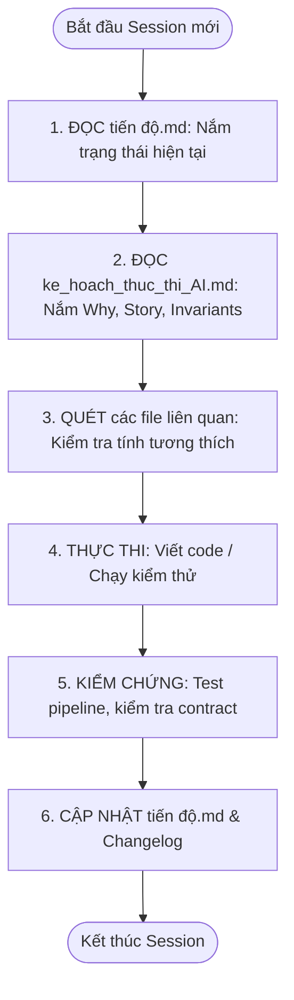

# 📘 KẾ HOẠCH THỰC THI CHI TIẾT HỆ THỐNG AI PHÂN TÍCH — ROADGUARD
> **Single Technical Blueprint & Agent Execution Guide**  
> **Dự án:** RoadGuard (Hệ thống AI Khảo sát & Quản lý Hư hỏng Đường bộ Nông thôn)  
> **Dành cho:** AI Coding Agents & Kỹ sư AI/ML tham gia phát triển.  
> **Quy tắc bất biến:** Mọi AI Agent trước và sau khi làm việc BẮT BUỘC đọc và cập nhật [tiến độ.md](file:///f:/train%20AI%20đồ%20án/tiến%20độ.md).

---

## MỤC LỤC
1. [Tổng Quan Kiến Trúc & Ranh Giới Phạm Vi (Scope)](#1-tổng-quan-kiến-trúc--ranh-giới-phạm-vi-scope)
2. [Quy Tắc Vận Hành Của AI Agent (Agent Rules & Code Integrity)](#2-quy-tắc-vận-hành-của-ai-agent-agent-rules--code-integrity)
3. [Kế Hoạch Chi Tiết Từng Epic & Nhiệm Vụ Kỹ Thuật (Epics & Tasks Breakdown)](#3-kế-hoạch-chi-tiết-từng-epic--nhiệm-vụ-kỹ-thuật-epics--tasks-breakdown)
   - [EPIC 1: Video Ingestion, Telemetry Sync & Quality Gate](#epic-1-video-ingestion-telemetry-sync--quality-gate)
   - [EPIC 2: Model Architecture, Training & Active Learning](#epic-2-model-architecture-training--active-learning)
   - [EPIC 3: Spatial Tiling & Inference Engine](#epic-3-spatial-tiling--inference-engine)
   - [EPIC 4: 2D Metric Estimation & Spatial Tracking](#epic-4-2d-metric-estimation--spatial-tracking)
   - [EPIC 5: Backend Integration, Async Worker & API Contract](#epic-5-backend-integration-async-worker--api-contract)
   - [EPIC 6: Quality Gate, Field Validation & Benchmarking](#epic-6-quality-gate-field-validation--benchmarking)
4. [Kế Hoạch Thực Thi Theo Giai Đoạn (Execution Timeline)](#4-kế-hoạch-thực-thi-theo-giai-đoạn-execution-timeline)

---

## 1. Tổng Quan Kiến Trúc & Ranh Giới Phạm Vi (Scope)

### 1.1 Bài toán nghiệp vụ
Đường và cầu bê-tông nông thôn (đặc biệt khu vực miền Nam Việt Nam) thường xuyên xuất hiện ổ gà (`pothole`), nứt dọc (`longitudinal`), nứt ngang (`transverse`), nứt chân chim (`alligator`), xói lở mép lề (`edge_crack`) và bong tróc bê-tông (`spalling`).
Khảo sát thủ công bằng mắt thường tốn nhân công, chậm trễ, nguy hiểm và thiếu cơ sở dữ liệu số hóa có định vị địa lý chính xác.

### 1.2 Giải pháp công nghệ
Sử dụng Flycam phổ thông (**DJI Mini 2 SE**) bay ở độ cao thấp ($5\text{m} - 15\text{m}$) thu hình video 2.7K kèm file phụ đề telemetry `.SRT`.
Hệ thống AI xử lý bất đồng bộ qua 4 tầng:
```
[Video 2.7K MP4 + DJI SRT]
       │
       ▼
[TẦNG 1: TIỀN XỬ LÝ & ĐỒNG BỘ VIỄN THÁM] ──> Lọc mờ Laplacian, trích xuất 2 fps, tính GSD mm/px
       │
       ▼
[TẦNG 2: CẮT MẢNH KHÔNG GIAN 640x640]   ──> Chia lưới Tile có overlap 20%, bảo toàn vết nứt nhỏ
       │
       ▼
[TẦNG 3: MÔ HÌNH HỌC SÂU YOLOV11N]      ──> Inference trên từng tile, NMS gom box về frame gốc 2.7K
       │
       ▼
[TẦNG 4: ĐO ĐẠC VẬT LÝ & SPATIAL TRACK] ──> Đổi px sang mm, ByteTrack khử trùng lặp qua các frame
       │
       ▼
[XUẤT KẾT QUẢ CHO BACKEND ASP.NET CORE]  ──> Payload AIDetection bất biến, GeoJSON, CSDL SQL Server
```

### 1.3 Ranh giới trách nhiệm (System Boundary - ADR 003)
- **Thuộc scope Đội AI:** Toàn bộ quá trình xử lý video, đồng bộ viễn thám, cắt tile, chạy model AI, đo đạc kích thước 2D, theo dõi khử trùng lặp và xuất payload JSON chuẩn `AIDetection`.
- **KHÔNG thuộc scope Đội AI:**
  + Không tự ý duyệt chuyển trạng thái hư hỏng thành `VERIFIED` (đây là thẩm quyền của PM).
  + Không tự động lập đợt sửa chữa hay phê duyệt chi phí dự toán (thẩm quyền của Supervisor).
  + Không thay thế việc đo đạc chiều sâu ổ gà/độ lún bê-tông bằng thước cơ học thực địa (`GroundTruthMeasurement`).

---

## 2. Quy Tắc Vận Hành Của AI Agent (Agent Rules & Code Integrity)

Để tránh tình trạng agent sửa code tùy tiện gây lỗi ngớ ngẩn (vớ vẩn) hoặc gãy cấu trúc hệ thống:



1. **Rule R01 — Pre-session Check:** Trước khi code, đọc `tiến độ.md` và quét các file liên quan.
2. **Rule R02 — Single Source of Truth:** `ke_hoach_thuc_thi_AI.md` là kim chỉ nam logic. Mọi thay đổi logic phải được cập nhật vào đây trước.
3. **Rule R03 — Cross-File Impact Scan:** Khi sửa bất kỳ hàm nào trong `hadle_vid.py`, `srt_gps_parser.py` hoặc `trainAI_watch_img.py`, phải kiểm tra xem các script gọi nó có bị gãy tham số không.
4. **Rule R04 — Post-session Update:** Khi kết thúc turn hoặc xong 1 sub-task, cập nhật checkbox trong `tiến độ.md` và ghi dòng lịch sử thay đổi.

---

## 3. Kế Hoạch Chi Tiết Từng Epic & Nhiệm Vụ Kỹ Thuật

---

### EPIC 1: Video Ingestion, Telemetry Sync & Quality Gate
*Mục tiêu: Đảm bảo dữ liệu đầu vào từ Flycam được làm sạch, đồng bộ không gian chính xác trước khi đưa vào mô hình AI.*

#### Task 1.1: Frame Sampling Engine (Bộ trích xuất lấy mẫu khung hình)
- **User Story:**  
  *Là một AI Processing Service, tôi muốn trích xuất khung hình từ video 2.7K với tần suất 2 fps (1 frame mỗi 15 frame video 30fps), để giảm tải lượng dữ liệu dư thừa 85% mà vẫn đảm bảo độ chồng lấn $\ge 60\%$ giữa các frame khi drone bay.*
- **Lý do thực hiện (Why & Rationale):**  
  Video quay 30fps tạo ra 1,800 frame mỗi phút. Drone bay khảo sát ở vận tốc 3–5 m/s. Nếu xử lý toàn bộ 30fps sẽ gây lãng phí tài nguyên GPU gấp 15 lần một cách vô nghĩa, vì hai khung hình cách nhau 33ms hầu như không đổi góc nhìn. Tần suất 2 fps (mỗi 0.5s lấy 1 frame, tương đương drone di chuyển 1.5 - 2.5m) là điểm tối ưu cân bằng hoàn hảo giữa độ phủ và tài nguyên tính toán.
- **Input:** Đường dẫn file video `.MP4` (DJI Mini 2 SE, $2720 \times 1530$ @ 30fps).
- **Output:** Thư mục ảnh `frames/` chứa các tệp JPEG đánh số thứ tự `frame_000015.jpg`, `frame_000030.jpg`, kèm mảng metadata thời gian.
- **Ràng buộc (Constraints):** Giữ chất lượng JPEG $\ge 95\%$, không áp dụng resize ở bước này để tránh mất chi tiết vết nứt.
- **Mối liên hệ (Dependencies):** Đầu vào cho Task 1.2 và Task 3.1.
- **File phụ trách:** [hadle_vid.py](file:///f:/train%20AI%20đồ%20án/hadle_vid.py) (Class `VideoFrameExtractor`).

#### Task 1.2: Motion Blur Detection & Quality Check (Bộ lọc rung lắc mờ nhòe - KS08)
- **User Story:**  
  *Là một Drone Operator và PM, tôi muốn hệ thống tự động loại bỏ các khung hình bị mờ do gió giật hoặc drone đổi hướng đột ngột, để tránh cho AI nhận diện sai hoặc bỏ sót khuyết tật.*
- **Lý do thực hiện (Why & Rationale):**  
  DJI Mini 2 SE là dòng drone nhẹ (<249g), rất dễ bị rung lắc khi có gió giật cấp 4-5 ở nông thôn miền Nam. Khung hình bị nhòe chuyển động (motion blur) làm các cạnh vết nứt bị nhòe biên, dẫn đến mô hình AI hoặc bỏ sót (False Negative) hoặc đoán mò (False Positive). Áp dụng bộ lọc Laplacian Variance giúp gác cổng chất lượng tự động.
- **Công thức & Ngưỡng:**
  $$\text{Score} = \text{Var}(\nabla^2 I) = \frac{1}{N}\sum (L(x,y) - \bar{L})^2$$
  Nếu $\text{Score} < 100.0 \implies \text{Frame bị mờ (Skip)}$.
- **Input:** Khung hình dạng ma trận ảnh xám `cv2.cvtColor(frame, cv2.COLOR_BGR2GRAY)`.
- **Output:** Boolean `is_blurry`, điểm số `blur_score`.
- **Ràng buộc:** Nếu một phân đoạn có $>30\%$ số frame bị mờ, phát sinh mã cảnh báo `DATA_FAILURE` gửi về Backend để thông báo PM yêu cầu bay bổ sung (`KS11`).
- **File phụ trách:** [hadle_vid.py](file:///f:/train%20AI%20đồ%20án/hadle_vid.py) (Hàm `is_blurry`).

#### Task 1.3: DJI SRT Telemetry Parser & Realtime GSD Calculation
- **User Story:**  
  *Là một AI System, tôi muốn đọc tọa độ GPS và độ cao bay từ file SRT của DJI theo từng mili-giây, để tính toán chỉ số GSD (mm/pixel) phục vụ cho việc đo đạc kích thước thực tế sau này.*
- **Lý do thực hiện (Why & Rationale):**  
  Flycam không bay ở một độ cao cố định mà thay đổi liên tục theo địa hình (ví dụ từ 8.2m lên 10.5m khi qua cầu). Kích thước vật lý của 1 pixel trên mặt đất (GSD) phụ thuộc trực tiếp vào độ cao bay. Nếu không parse SRT theo từng frame, chúng ta không thể biết 1 vết nứt rộng 10 pixel là 7mm hay 15mm.
- **Công thức tính toán GSD thời gian thực:**
  $$\text{GSD} = \frac{\text{Altitude (m)} \times 1000 \times \text{Sensor Width (6.17 mm)}}{\text{Focal Length (4.26 mm)} \times \text{Image Width (2720 px)}} \quad (\text{mm/pixel})$$
- **Bảng tham chiếu GSD chuẩn (DJI Mini 2 SE):**
  - Bay ở 5m: $\text{GSD} = 0.71\text{ mm/px} \rightarrow$ Phát hiện vết nứt từ 2mm (Tốt nhất).
  - Bay ở 10m: $\text{GSD} = 1.43\text{ mm/px} \rightarrow$ Phát hiện vết nứt từ 5mm (Đủ dùng).
  - Bay $>20\text{m}$: $\text{GSD} > 2.86\text{ mm/px} \rightarrow$ Cảnh báo: Chỉ phát hiện được ổ gà lớn, không thấy nứt mảnh.
- **Input:** File `.SRT` đi kèm video.
- **Output:** Đối tượng `FrameTelemetry` chứa `latitude`, `longitude`, `rel_alt_m`, `gimbal_pitch`, `gsd_mm_per_px`.
- **File phụ trách:** [srt_gps_parser.py](file:///f:/train%20AI%20đồ%20án/srt_gps_parser.py).

---

### EPIC 2: Model Architecture, Training & Active Learning
*Mục tiêu: Đào tạo mô hình AI nhận diện chính xác 8 loại khuyết tật mặt đường bê-tông nông thôn từ góc nhìn thẳng đứng của Flycam.*

#### Task 2.1: Dataset Normalization & 8 Classes Target
- **User Story:**  
  *Là một AI Engineer, tôi muốn chuẩn hóa toàn bộ các tập dữ liệu từ Roboflow, CRACK500, RDD2022 về 1 định dạng nhãn chuẩn YOLO (Polygon / BBox) khớp 100% với danh mục DefectType của hệ thống.*
- **Lý do thực hiện (Why & Rationale):**  
  Mỗi tập dữ liệu trên mạng dùng một quy ước khác nhau (RDD2022 dùng XML VOC với mã D00, D10, D20, D40; CRACK500 dùng ảnh đen trắng binary mask; Roboflow dùng YOLO txt). Nếu không quy chuẩn về bảng mã `DefectType.code` của hệ thống RoadGuard, Backend C# sẽ từ chối nhận diện do sai danh mục khóa ngoại (Foreign Key).
- **Bảng Mapping Chuẩn 8 Classes:**
  | ID | `defect_type_code` | Tên tiếng Việt | Mức độ nghiêm trọng mặc định | Nguồn dữ liệu |
  |:---:|:---|:---|:---:|:---|
  | 0 | `pothole` | Ổ gà, hố sụt | `CRITICAL` | Roboflow (3,940 ảnh), RDD2022 D40 |
  | 1 | `longitudinal_crack` | Nứt dọc | `MEDIUM` | RDD2022 D00, CRACK500 |
  | 2 | `transverse_crack` | Nứt ngang | `MEDIUM` | RDD2022 D10, CRACK500 |
  | 3 | `alligator_crack` | Nứt chân chim / mai rùa | `HIGH` | RDD2022 D20, CRACK500 |
  | 4 | `edge_crack` | Nứt mép / sạt lề đường | `HIGH` | Label Drone thực tế |
  | 5 | `block_crack` | Nứt khối chữ nhật | `MEDIUM` | RDD2022, Drone thực tế |
  | 6 | `spalling` | Bong tróc vỡ bê-tông | `HIGH` | Label Drone thực tế |
  | 7 | `raveling` | Tróc rỗ bề mặt đá dăm | `LOW` | Label Drone thực tế |
- **File cấu hình:** [pothole_dataset.yaml](file:///f:/train%20AI%20đồ%20án/pothole_dataset.yaml), `crack_dataset.yaml`.

#### Task 2.2: Transfer Learning với YOLOv11n (Base weights `best.pt`)
- **User Story:**  
  *Là một AI Engineer, tôi muốn dùng base weights `best.pt` để fine-tune mô hình với các phép biến đổi ảnh (Augmentation) tối ưu cho góc nhìn trên cao của Flycam, để mô hình đạt mAP50 $> 0.65$.*
- **Lý do thực hiện (Why & Rationale):**  
  Train từ đầu (scratch) cần hàng chục nghìn ảnh và hàng trăm giờ GPU. Dùng kỹ thuật Transfer Learning từ `best.pt` (YOLOv11n pretrained) giúp model tận dụng các bộ lọc cạnh/góc cấp thấp đã học được, chỉ cần học thêm các đặc trưng đặc thù của vết nứt và ổ gà.
- **Chiến lược Augmentation góc nhìn Drone:**
  - `degrees: 45.0`: Drone chụp nhìn thẳng xuống đất (Nadir view) thì xoay góc nào vết nứt cũng giữ nguyên bản chất vật lý.
  - `flipud: 0.5` & `fliplr: 0.5`: Lật trên dưới và trái phải ngẫu nhiên.
  - `scale: 0.5`: Co giãn ngẫu nhiên mô phỏng sự thay đổi độ cao bay từ 5m đến 15m.
  - `hsv_v: 0.5`: Biến đổi độ sáng lớn để thích nghi với nắng gắt hoặc bóng cây ven đường nông thôn.
- **File phụ trách:** [train_crack_model.py](file:///f:/train%20AI%20đồ%20án/train_crack_model.py), [train_pothole_model.py](file:///f:/train%20AI%20đồ%20án/train_pothole_model.py).

#### Task 2.3: Quản lý phiên bản mô hình AI (AIModelVersion Registry - QT06)
- **User Story:**  
  *Là một Quản trị viên (Admin) và PM, tôi muốn mỗi model xuất xưởng đều được định danh phiên bản rõ ràng kèm chỉ số đánh giá và ngưỡng vận hành, để hệ thống luôn truy vết được kết quả AI sinh ra từ model nào.*
- **Lý do thực hiện (Why & Rationale):**  
  Một lỗi phát hiện vào tháng 1 có thể do model v1 phát hiện, tháng 3 do model v2 phát hiện. Nếu không quản lý phiên bản độc lập, khi cập nhật model mới sẽ làm sai lệch dữ liệu lịch sử.
- **Ràng buộc bất biến (Invariant QT06.2):**  
  Khi phát hành phiên bản mô hình mới, **TUYỆT ĐỐI KHÔNG ĐƯỢC** cascade update trường `model_version_id` của các bản ghi `AIDetection` đã tạo trong quá khứ.
- **Output:** Tệp trọng số `.pt` kèm JSON metadata:
  ```json
  {
    "version_label": "yolo11n-pothole-v1.0.0",
    "metrics": {"mAP50": 0.724, "precision": 0.781, "recall": 0.695},
    "operating_thresholds": {"conf_threshold": 0.35, "iou_threshold": 0.45}
  }
  ```

---

### EPIC 3: Spatial Tiling & Inference Engine
*Mục tiêu: Xử lý triệt để bài toán vết nứt mảnh bị mờ nhòe trên ảnh độ phân giải cao 2.7K bằng kỹ thuật cắt lưới không gian.*

#### Task 3.1: Dynamic Slicing / Tiling 640x640 Grid
- **User Story:**  
  *Là một AI Inference Engine, tôi muốn cắt khung hình 2.7K ($2720 \times 1530$) thành các mảnh nhỏ $640 \times 640$ có độ gối đầu $20\%$, để đưa vào mạng YOLO với độ phân giải nguyên bản mà không bị nén mất chi tiết vết nứt.*
- **Lý do thực hiện (Why & Rationale):**  
  Nếu đưa trực tiếp ảnh $2720 \times 1530$ về kích thước chuẩn YOLO $640 \times 640$, tỉ lệ thu nhỏ là $\approx 4.25$ lần. Một vết nứt có bề rộng thực tế 3 pixel trên ảnh gốc sẽ bị nén lại thành $< 0.7$ pixel $\rightarrow$ vết nứt biến mất hoàn toàn! Kỹ thuật Tiling cắt lưới $5 \times 3$ tiles giữ nguyên kích thước pixel gốc, đảm bảo mọi chi tiết mảnh đều được mạng nơ-ron nhìn thấy rõ ràng.
- **Công thức tính Overlap:**
  $$\text{Stride} = \text{Tile Size} \times (1 - \text{Overlap}) = 640 \times (1 - 0.20) = 512\text{ px}$$
- **File phụ trách:** [hadle_vid.py](file:///f:/train%20AI%20đồ%20án/hadle_vid.py) (Hàm `slice_frame_to_tiles`).

#### Task 3.2: Cross-Tile NMS Merging (Ghép hộp nhận diện xuyên Tile)
- **User Story:**  
  *Là một AI Engine, tôi muốn chiếu tọa độ detection từ các tile $640 \times 640$ về khung hình gốc $2720 \times 1530$ và khử trùng lặp, để một ổ gà nằm ở vùng overlap giữa 2 tile không bị đếm thành 2 ổ gà riêng biệt.*
- **Lý do thực hiện (Why & Rationale):**  
  Do các tile có vùng chồng lấn $20\%$, một đối tượng nằm ở rìa tile này cũng sẽ xuất hiện ở rìa tile bên cạnh. Sau khi mô hình inference trên từng mảnh, chúng ta phải chuyển tọa độ cục bộ $(x_t, y_t)$ thành tọa độ toàn cục $(X, Y)$ trên ảnh 2.7K:
  $$X = x_{\text{offset}} + x_t, \quad Y = y_{\text{offset}} + y_t$$
  Sau đó chạy thuật toán Non-Maximum Suppression (NMS) với ngưỡng $\text{IoU} = 0.45$ để gộp các box trùng.
- **File phụ trách:** [hadle_vid.py](file:///f:/train%20AI%20đồ%20án/hadle_vid.py) (Hàm `merge_tile_detections`).

#### Task 3.3: Target Bands & Context Overlap (AI15, AI17, US-26)
- **User Story:**  
  *Là một PM, tôi muốn chỉ định phân tích riêng dải mặt đường (SURFACE) hoặc mép lề (LEFT_EDGE, RIGHT_EDGE), và hệ thống phải tự động giữ lại ngữ cảnh biên giữa các segment đường để không làm gián đoạn vết nứt.*
- **Lý do thực hiện (Why & Rationale):**  
  Nứt mép đường (`edge_crack`) và xói lở lề thường xảy ra ở sát rìa bê-tông, trong khi nứt vệt bánh xe xuất hiện ở lòng đường. Việc phân tách `target_band` giúp tối ưu hóa sự tập trung của model và phục vụ đúng gói bảo trì. Đồng thời, các vết nứt kéo dài qua ranh giới giữa 2 segment (ví dụ dài 50m) cần dải đệm biên (Context Overlap $10 - 15\%$) để không bị cắt đôi.
- **Ràng buộc:** Giữ nguyên các quan sát gốc ở biên; lỗi vắt qua ranh giới tạo 1 `Defect` liên kết nhiều segment (`DefectSegment`).

---

### EPIC 4: 2D Metric Estimation & Spatial Tracking
*Mục tiêu: Đổi kích thước pixel sang đơn vị đo lường vật lý và theo dõi đối tượng qua nhiều khung hình liên tiếp.*

#### Task 4.1: Đo đạc kích thước 2D & Phân loại mức độ nghiêm trọng (Severity)
- **User Story:**  
  *Là một PM, tôi muốn hệ thống ước lượng chiều rộng (mm) và chiều dài (m) của vết nứt/ổ gà từ GSD, và tự động xếp loại mức độ nghiêm trọng (LOW, MEDIUM, HIGH, CRITICAL).*
- **Lý do thực hiện (Why & Rationale):**  
  Con người không thể đánh giá độ nguy hiểm nếu chỉ nhìn số pixel trên ảnh. Cần quy đổi trực tiếp ra milimet để kỹ sư cầu đường biết mức độ phá hủy kết cấu.
- **Công thức:**
  $$\text{Width (mm)} = \text{BBox Width (px)} \times \text{GSD}$$
  $$\text{Length (m)} = \frac{\text{BBox Length (px)} \times \text{GSD}}{1000}$$
- **Phân cấp nghiêm trọng theo tiêu chuẩn kỹ thuật:**
  - `LOW`: Nứt chân chim, bề rộng $< 2\text{ mm}$.
  - `MEDIUM`: Nứt bề rộng $2 - 5\text{ mm}$.
  - `HIGH`: Nứt bề rộng $> 5\text{ mm}$, bong tróc bê-tông (`spalling`).
  - `CRITICAL`: Ổ gà (`pothole`), sụt lún mép nguy hiểm cho phương tiện giao thông.
- **Ràng buộc Domain Model:** Bắt buộc gắn cờ `is_2d_estimate = true`. Số đo này chỉ là ước lượng hình ảnh, không thay thế cho số đo độ sâu thực địa bằng thước cơ học (`GroundTruthMeasurement`).
- **File phụ trách:** [trainAI_watch_img.py](file:///f:/train%20AI%20đồ%20án/trainAI_watch_img.py).

#### Task 4.2: Phép chiếu tọa độ địa lý (Defect Georeferencing)
- **User Story:**  
  *Là một PM và GIS Specialist, tôi muốn mỗi khuyết tật có tọa độ địa lý chính xác trên mặt đất, phân biệt rõ với tọa độ bay của Flycam.*
- **Lý do thực hiện (Why & Rationale):**  
  **Đây là lỗi phổ biến nhất:** Nhiều hệ thống lấy luôn kinh/vĩ độ GPS của máy bay gán làm tọa độ của ổ gà dưới đất. Khi drone bay ở độ cao 15m với góc gimbal nghiêng $60^\circ$, vết nứt nằm cách vị trí thẳng đứng của drone từ 8 đến 10 mét!
- **Ràng buộc bất biến:**
  - `aircraft_location`: Tọa độ WGS84 của thân Drone trên không.
  - `geometry`: Tọa độ mặt đất của vết nứt sau khi chiếu quang học từ Gimbal Pitch và độ cao $h$.
  - Nếu không đủ dữ liệu góc gimbal, bắt buộc đặt `defect_location_method = UNKNOWN`.

#### Task 4.3: Tracking đa khung hình & Khử trùng lặp đối tượng (Frame-to-Frame Deduplication - AI08)
- **User Story:**  
  *Là một PM, tôi muốn hệ thống theo dõi cùng một ổ gà khi nó xuất hiện qua 5 khung hình liên tiếp khi drone bay qua, và đề xuất gộp chúng lại thành các quan sát của một hư hỏng duy nhất.*
- **Lý do thực hiện (Why & Rationale):**  
  Khi Flycam bay với vận tốc 3m/s và quay ở tần suất 2 fps, mỗi 0.5s chụp 1 frame. Một ổ gà dài 1m sẽ nằm trong tầm nhìn của camera suốt 2 - 3 giây (khoảng 4 - 6 frame liên tiếp). Nếu không có thuật toán tracking, 1 ổ gà sẽ bị đếm thành 6 ổ gà trong báo cáo $\rightarrow$ Sai lệch nghiêm trọng về số lượng và dự toán chi phí sửa chữa!
- **Giải pháp kỹ thuật:**  
  Ứng dụng **ByteTrack** kết hợp bù trừ chuyển động GPS của drone (GPS Motion Vector):
  - Dự đoán vị trí của ổ gà ở frame tiếp theo: $\mathbf{p}_{t+1} = \mathbf{p}_t - \mathbf{v}_{\text{drone}} \cdot \Delta t$.
  - Tính khoảng cách không gian giữa detection mới và detection dự đoán. Nếu khoảng cách $< 1.5\text{m}$ và cùng class $\rightarrow$ gán chung `tracking_id`.
- **Ràng buộc bất biến (Invariant AI08):**  
  Hệ thống AI chỉ sinh ra các liên kết đề xuất `DefectObservation`. Quyền quyết định gộp chính thức thành 1 `Defect` duy nhất thuộc về PM (`AI08`).

---

### EPIC 5: Backend Integration, Async Worker & API Contract
*Mục tiêu: Đóng gói AI Service thành một Worker bất đồng bộ giao tiếp chuẩn mực, chịu lỗi cao với Backend ASP.NET Core.*

#### Task 5.1: Chuẩn hóa Schema JSON Response (`AIDetection` Contract - AI16)
- **User Story:**  
  *Là một Backend Developer, tôi muốn kết quả trả về từ AI Service tuân thủ 100% Data Dictionary của bảng `AIDetection`, không có trường thừa hoặc thiếu.*
- **Cấu trúc JSON Payload bắt buộc:**
  ```json
  {
    "processing_job_id": "3fa85f64-5717-4562-b3fc-2c963f66afa6",
    "model_version_id": "c3b9e4a1-1234-5678-abcd-000000000001",
    "status": "COMPLETED",
    "detections": [
      {
        "id": "7b1deb4d-3b7d-4bad-9bdd-2b0d7b3dcb01",
        "defect_type_code": "pothole",
        "confidence": 0.892,
        "is_2d_estimate": true,
        "estimated_width": 350.0,
        "estimated_length": 0.45,
        "defect_location_method": "OBSERVED_FOOTPRINT",
        "geometry": "POINT(106.660172 10.762622)",
        "aircraft_location": "POINT(106.660168 10.762615)",
        "location_uncertainty_m": 1.5,
        "camera_pose_json": {
          "altitude_m": 8.5,
          "gimbal_pitch": -90.0,
          "gsd_mm_per_px": 1.21,
          "frame_index": 30,
          "timestamp_ms": 15000
        },
        "raw_payload": {
          "bbox_normalized": [0.45, 0.52, 0.12, 0.08],
          "polygon": [[0.45, 0.52], [0.48, 0.53], [0.47, 0.60]],
          "crop_uri": "s3://roadguard/crops/job_3fa/det_7b1.jpg"
        }
      }
    ]
  }
  ```
- **Ràng buộc:** Kết quả trả về là **bất biến (immutable)**; Backend lưu thẳng vào CSDL, không chỉnh sửa trực tiếp trên bản ghi thô này.

#### Task 5.2: Cơ chế Idempotency & Phân loại lỗi (Error Classification)
- **User Story:**  
  *Là một Hệ thống chịu lỗi, tôi muốn phân biệt rõ lỗi phần cứng (để tự động retry) và lỗi dữ liệu (để dừng và báo người dùng), đồng thời không bao giờ xử lý lặp lại cùng một yêu cầu.*
- **Lý do thực hiện (Why & Rationale):**  
  Theo tài liệu miền nghiệp vụ (`ProcessingAttempt.error_type`): Nếu GPU bị tràn bộ nhớ (OOM) hoặc mạng chập chờn, đây là lỗi hạ tầng (`INFRASTRUCTURE`) $\rightarrow$ Backend được phép thử lại có giãn cách (exponential backoff). Nhưng nếu video bị thiếu file SRT hoặc ảnh đen sì, đây là lỗi dữ liệu (`DATA`) $\rightarrow$ Thử lại 100 lần vẫn sẽ lỗi, do đó phải dừng ngay và chuyển PM quyết định.
- **Idempotency Key:**
  $$\text{idempotency\_key} = \text{SHA256}(\text{ProcessingBlockId} + \text{ModelVersionId} + \text{InputChecksum})$$
  Nếu nhận lại cùng key $\rightarrow$ Trả lại kết quả trong cache ngay lập tức.

#### Task 5.3: Xây dựng Mock AI Adapter (Kiểm thử độc lập cho Backend)
- **User Story:**  
  *Là một Backend Developer, tôi muốn có một adapter giả lập AI trả về dữ liệu mẫu chuẩn hợp đồng ngay lập tức, để kiểm thử toàn bộ luồng nghiệp vụ trên Backend C# mà không cần chờ nạp GPU AI thật.*
- **Đặc điểm Mock Adapter:**
  - Gắn nhãn `is_mock = true` và `source_label = "MOCK_AI_ADAPTER"`.
  - Sinh dữ liệu khuyết tật mẫu có tọa độ nằm chính xác trên tim tuyến đường kiểm thử.
  - Phản hồi nhanh $< 500\text{ ms}$.

---

### EPIC 6: Quality Gate, Field Validation & Benchmarking
*Mục tiêu: Nghiệm thu hiệu năng xử lý, độ chính xác mô hình và đối chiếu số đo với thực địa theo đề cương nghiên cứu.*

#### Task 6.1: Benchmark End-to-End Pipeline Performance
- **Tiêu chuẩn:** Video 2.7K dài 5 phút (300 giây = 9,000 frames thô $\rightarrow$ trích xuất 600 frames xử lý) phải hoàn thành toàn bộ pipeline từ lúc nhận video đến khi trả JSON trong thời gian $\le 5\text{ phút}$ (trên card GPU tương đương Tesla T4).

#### Task 6.2: Nghiệm thu độ chính xác mô hình
- **Tiêu chuẩn kiểm thử độc lập (Test Set 198 ảnh):**
  - $\text{mAP50} \ge 0.65$ trên tập Pothole.
  - Precision $\ge 0.70$, Recall $\ge 0.60$.
  - Không có hiện tượng đoán bừa ổ gà trên các vệt bóng râm cây cối.

#### Task 6.3: Báo cáo đối chiếu số đo nghiên cứu (Research Validation - RS01–RS06)
- **Tiêu chuẩn:** Thu thập tập mẫu kiểm thử ghép cặp giữa số đo ước lượng của Drone (`DerivedMeasurement`) và số đo thước đo cơ học tại hiện trường (`GroundTruthMeasurement`), tính toán sai số tuyệt đối (`absolute_error`) và độ không chắc chắn đo lường (`measurement_uncertainty`).

---

## 4. Kế Hoạch Thực Thi Theo Giai Đoạn (Execution Timeline)

```
Tuần 1: Củng cố Nền Tảng & Hoàn Tất Model Pothole v1
  ├── [x] Hoàn thiện trích xuất frame & lọc mờ (hadle_vid.py)
  ├── [x] Hoàn thiện SRT GPS & GSD realtime (srt_gps_parser.py)
  ├── [x] Chuẩn bị 3,940 ảnh Pothole & cấu hình YAML
  └── [ ] Huấn luyện GPU T4 xuất xưởng pothole_best.pt (Task 2.2)

Tuần 2: Hoàn Thiện Tiling 640x640 & Đo Đạc 2D
  ├── [ ] Cắt tile 640x640 có overlap 20% & NMS merge (Task 3.1, 3.2)
  ├── [ ] Hiệu chỉnh tính toán GSD -> mm chiều rộng & m chiều dài (Task 4.1)
  └── [ ] Viết Mock AI Adapter cho Backend ASP.NET Core kiểm thử (Task 5.3)

Tuần 3: Spatial Tracking & API Contract Standardization
  ├── [ ] Tích hợp ByteTrack khử trùng lặp đa khung hình (Task 4.3)
  ├── [ ] Phép chiếu tọa độ địa lý Defect Georeferencing (Task 4.2)
  └── [ ] Chuẩn hóa JSON Payload AIDetection Contract (Task 5.1)

Tuần 4: Nghiệm Thu Tích Hợp End-to-End & Active Learning
  ├── [ ] Tích hợp với Backend qua hàng đợi xử lý bất đồng bộ (Task 5.2)
  ├── [ ] Mở rộng dữ liệu 8 classes (CRACK500, RDD2022) (Task 2.4)
  └── [ ] Benchmark toàn diện: Video 5 phút -> JSON Report trong < 5 phút (Task 6.1)
```

---

> 📌 **LỜI NHẮC CUỐI CHO MỌI AI AGENT:**  
> Luôn kiểm tra [tiến độ.md](file:///f:/train%20AI%20đồ%20án/tiến%20độ.md) trước khi code và cập nhật ngay sau khi xong bất kỳ việc gì!
