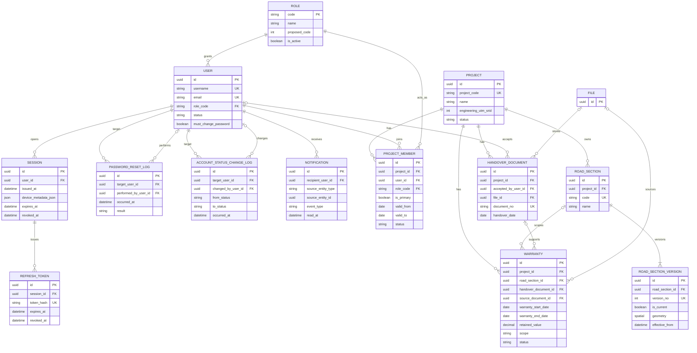
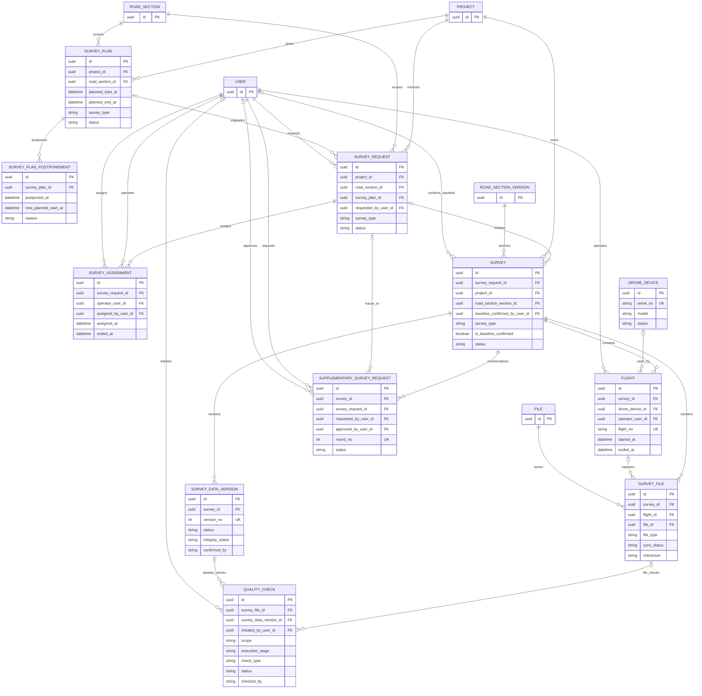
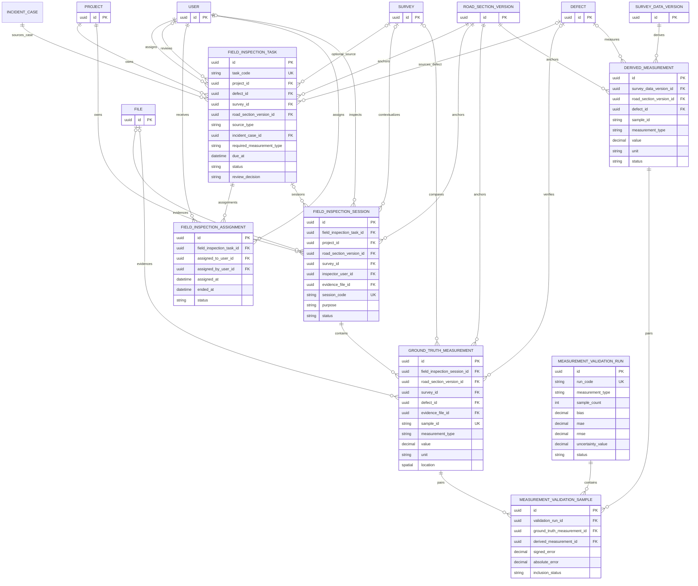
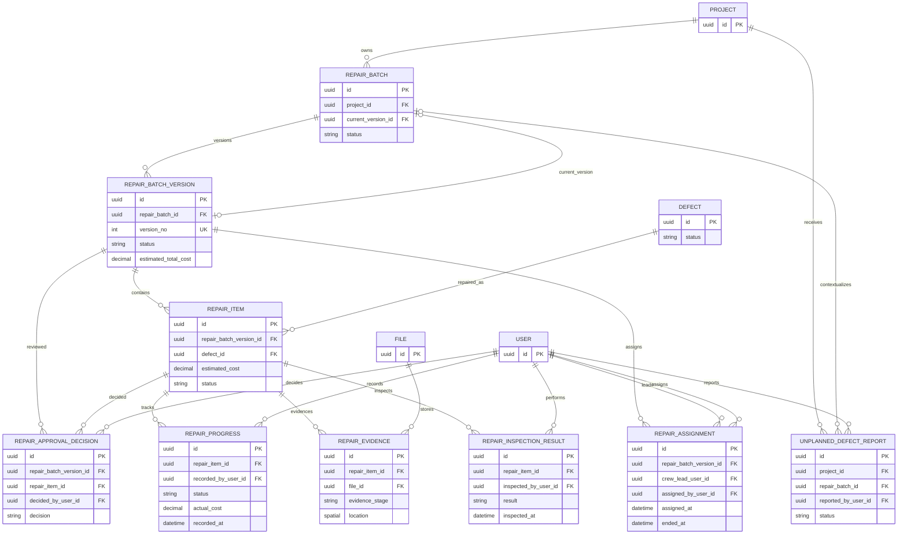
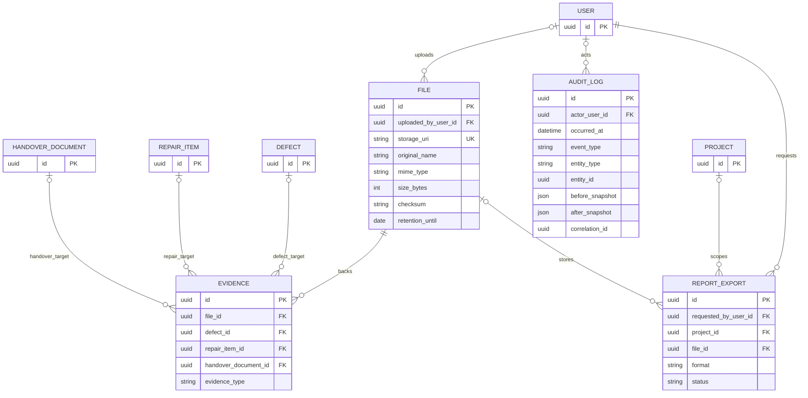
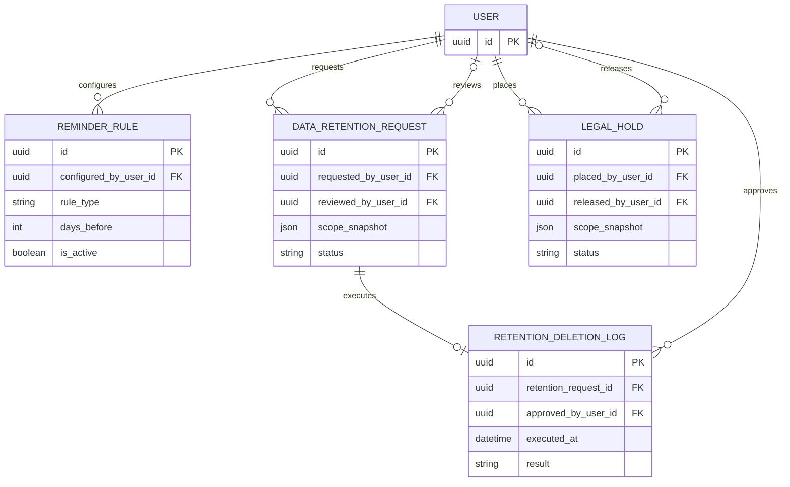

# RoadGuard - Entity Relationship Diagram v1

> Thiết kế đích đồng bộ ngày 22/09/2026 theo [RoadGuard_Incident_Segment_Design_v1.md](RoadGuard_Incident_Segment_Design_v1.md) và [RoadGuard_AI_Segment_Edge_Design_v1.md](RoadGuard_AI_Segment_Edge_Design_v1.md). Các entity/cột mới là đề xuất logical schema; không tuyên bố code hoặc migration đã có. Phần historical schema giữ tên cũ khi cần truy vết và được đánh dấu dưới đây. Mốc backend/mock AI ngày 18/09/2026 tại [ADR 003](../adr/003-backend-delivery-and-ai-boundary.md) không thay thế hợp đồng AI có phiên bản.

ERD logic nay duoc tong hop tu (Data Dictionary la nguon authoritative cho thiet ke dich):

- `RoadGuard_Data_Dictionary_v1.md`;
- `RoadGuard_Data_Dictionary_v1.md` (nguồn tên trường mới);
- `RoadGuard_Incident_Segment_Design_v1.md`;
- `RoadGuard_AI_Segment_Edge_Design_v1.md`;
- `RoadGuard_Domain_Model_v1.md` và `RoadGuard_Entity_List_v2.md` (lịch sử nền).

Data Dictionary la nguon chinh cho ten cot, khoa va nullability. Domain Model va Entity List duoc dung de xac dinh ownership, versioning va cac invariant lien aggregate.

## 1. Quy uoc

| Ky hieu | Y nghia |
|---|---|
| `PK` | Khoa chinh |
| `FK` | Khoa ngoai |
| `UK` | Khoa duy nhat hoac thanh phan cua khoa duy nhat |
| `||` | Dung mot |
| `o|` | Khong hoac mot |
| `|{` | Mot hoac nhieu |
| `o{` | Khong hoac nhieu |

Ghi chu:

- Ten bang/cot trong ERD dung `UPPER_SNAKE_CASE` de Mermaid hien thi on dinh; ten logic tuong ung la PascalCase/snake_case trong Data Dictionary.
- ERD chi hien thi khoa va cac thuoc tinh nghiep vu quan trong. Danh sach cot day du, kieu SQL Server va enum nam trong Data Dictionary.
- `AUDIT_LOG.entity_id` va `NOTIFICATION.source_entity_id` la tham chieu da hinh co chu dich, khong phai FK vat ly.
- `EVIDENCE` dung cac FK nullable rieng va bat buoc dung mot FK dich co gia tri.

## 2. Thiết kế đích Incident, Segment, Coverage và AI

Sơ đồ này là nguồn cardinality cho các phần historical diagrams bên dưới. `IncidentCase` tạo cùng lúc khi `IncidentReport` gửi (project có thể null); Reporter xem report của mình và các `ReportStatusEvent` đã công bố, không cần `ProjectMember`. Segment/job/video đều giữ version đã chụp lúc tạo.

```mermaid
erDiagram
    USER ||--o{ INCIDENT_REPORT : submits
    INCIDENT_CASE ||--o{ INCIDENT_REPORT : groups
    INCIDENT_REPORT ||--|{ REPORT_PHOTO : includes
    FILE ||--o{ REPORT_PHOTO : stores
    INCIDENT_REPORT ||--o{ REPORT_STATUS_EVENT : publishes
    INCIDENT_CASE ||--o{ REPORT_STATUS_EVENT : scopes
    REPORT_STATUS_EVENT ||--o{ REPORT_STATUS_EVENT_PHOTO : publishes
    REPAIR_EVIDENCE ||--o{ REPORT_STATUS_EVENT_PHOTO : supports_after_photo
    INCIDENT_CASE ||--o{ INCIDENT_CASE_HISTORY : changes
    INCIDENT_CASE ||--o{ INCIDENT_CASE_DEFECT : links
    DEFECT ||--o{ INCIDENT_CASE_DEFECT : appears_in
    PROJECT o|--o{ INCIDENT_CASE : routes
    ROAD_SECTION_VERSION o|--o{ INCIDENT_CASE : anchors
    ROAD_SECTION_VERSION ||--o{ ROAD_SEGMENT_SET : versions
    ROAD_SEGMENT_SET ||--|{ ROAD_SEGMENT : contains
    ROAD_SEGMENT ||--o{ ROAD_SEGMENT_MAPPING : source_or_target
    SURVEY_REQUEST ||--o{ SURVEY_WORK_ITEM : scopes
    ROAD_SEGMENT ||--o{ SURVEY_WORK_ITEM : assigned_scope
    SURVEY_WORK_ITEM ||--|{ SURVEY_COVERAGE_REQUIREMENT : requires_band
    SURVEY_COVERAGE_REQUIREMENT ||--o{ SURVEY_COVERAGE_RESULT : assessed_per_dataset
    SURVEY_COVERAGE_REQUIREMENT ||--o{ SURVEY_VIDEO_INTERVAL : maps_video
    SURVEY_DATA_VERSION ||--o{ SURVEY_VIDEO_INTERVAL : contains
    SURVEY_FILE ||--o{ SURVEY_VIDEO_INTERVAL : source_video
    SURVEY_DATA_VERSION ||--o{ PROCESSING_BLOCK : partitions
    PROCESSING_BLOCK ||--o{ PROCESSING_JOB : runs
    PROCESSING_JOB ||--|| PROCESSING_INPUT_MANIFEST : snapshots
    ROAD_SEGMENT_SET ||--o{ PROCESSING_INPUT_MANIFEST : snapshots_set
    ROAD_SEGMENT ||--o{ PROCESSING_INPUT_MANIFEST : snapshots_segment
    AI_MODEL_VERSION ||--o{ PROCESSING_INPUT_MANIFEST : model_scope
    PROCESSING_JOB ||--o{ AI_DETECTION : produces
    AI_DETECTION ||--o{ DEFECT_OBSERVATION : observed_as
    DEFECT ||--o{ DEFECT_OBSERVATION : groups_observations
    DEFECT ||--o{ DEFECT_SEGMENT : crosses
    ROAD_SEGMENT ||--o{ DEFECT_SEGMENT : affected_segment
    INCIDENT_CASE o|--o{ FIELD_INSPECTION_TASK : source_case
    DEFECT o|--o{ FIELD_INSPECTION_TASK : source_defect
    SURVEY o|--o{ FIELD_INSPECTION_TASK : optional_survey
    DEFECT ||--o{ DEFECT_VERIFICATION_LOG : verified
    AI_DETECTION o|--o{ DEFECT_VERIFICATION_LOG : reviewed

    INCIDENT_REPORT {
        uuid id PK
        uuid incident_case_id FK
        uuid project_id FK
        uuid reporter_user_id FK
        string reporter_type
    }
    INCIDENT_CASE {
        uuid id PK
        uuid project_id FK
        uuid road_section_version_id FK
        string status
        uuid related_case_id FK
    }
    REPORT_PHOTO {
        uuid id PK
        uuid incident_report_id FK
        uuid file_id FK
        spatial location
        string coordinate_source
        datetime captured_at
        decimal accuracy_m
    }
    REPORT_STATUS_EVENT {
        uuid id PK
        uuid incident_report_id FK
        uuid incident_case_id FK
        string event_code
    }
    REPORT_STATUS_EVENT_PHOTO {
        uuid id PK
        uuid report_status_event_id FK
        uuid repair_evidence_id FK
    }
    ROAD_SEGMENT_SET {
        uuid id PK
        uuid road_section_version_id FK
        int version_no UK
        decimal target_length_m
        string status
    }
    ROAD_SEGMENT {
        uuid id PK
        uuid segment_set_id FK
        decimal start_offset_m
        decimal end_offset_m
        spatial geometry
    }
    ROAD_SEGMENT_MAPPING {
        uuid id PK
        uuid source_segment_id FK
        uuid target_segment_id FK
        int mapping_version
        json provenance
    }
    SURVEY_WORK_ITEM {
        uuid id PK
        uuid survey_request_id FK
        uuid road_segment_id FK
    }
    SURVEY_COVERAGE_REQUIREMENT {
        uuid id PK
        uuid survey_work_item_id FK
        string target_band
    }
    SURVEY_COVERAGE_RESULT {
        uuid id PK
        uuid coverage_requirement_id FK
        uuid survey_data_version_id FK
        string status
    }
    SURVEY_VIDEO_INTERVAL {
        uuid id PK
        uuid coverage_requirement_id FK
        uuid survey_data_version_id FK
        uuid survey_file_id FK
        int start_time_ms
        int end_time_ms
        json source_metadata
    }
    PROCESSING_INPUT_MANIFEST {
        uuid id PK
        uuid processing_job_id FK UK
        uuid survey_data_version_id FK
        uuid segment_set_id FK
        uuid road_segment_id FK
        uuid model_version_id FK
        string target_band
        string checksum
        json source_metadata
        json context_overlap
    }
    DEFECT_OBSERVATION {
        uuid id PK
        uuid defect_id FK
        uuid ai_detection_id FK
        string deduplication_key UK
        json provenance
    }
    DEFECT_SEGMENT {
        uuid id PK
        uuid defect_id FK
        uuid road_segment_id FK
        string location_status
    }
```

## 2. Luong nghiep vu cot loi

```mermaid
erDiagram
    PROJECT ||--o{ ROAD_SECTION : owns
    ROAD_SECTION ||--|{ ROAD_SECTION_VERSION : versions
    PROJECT ||--o{ SURVEY_REQUEST : receives
    SURVEY_REQUEST o|--o{ SURVEY : initiates
    ROAD_SECTION_VERSION ||--o{ SURVEY : anchors
    SURVEY ||--o{ FLIGHT : contains
    SURVEY ||--o{ SURVEY_FILE : contains
    SURVEY ||--o{ SURVEY_DATA_VERSION : versions
    SURVEY_DATA_VERSION ||--o{ PROCESSING_BLOCK : partitions
    PROCESSING_BLOCK ||--o{ PROCESSING_JOB : runs
    PROCESSING_JOB ||--o{ AI_DETECTION : produces
    AI_DETECTION o|--o| DEFECT : originates
    INCIDENT_CASE ||--o{ FIELD_INSPECTION_TASK : sources_case
    DEFECT o|--o{ FIELD_INSPECTION_TASK : sources_defect
    FIELD_INSPECTION_TASK o|--o{ FIELD_INSPECTION_SESSION : collects
    FIELD_INSPECTION_SESSION ||--o{ GROUND_TRUTH_MEASUREMENT : contains
    DEFECT o|--o{ GROUND_TRUTH_MEASUREMENT : optional_target
    DEFECT ||--o{ REPAIR_ITEM : selected_for
    REPAIR_BATCH ||--o{ REPAIR_BATCH_VERSION : versions
    REPAIR_BATCH_VERSION ||--o{ REPAIR_ITEM : contains
    REPAIR_ITEM ||--o{ REPAIR_PROGRESS : tracks
    REPAIR_ITEM ||--o{ REPAIR_EVIDENCE : proves
    REPAIR_ITEM ||--o{ REPAIR_INSPECTION_RESULT : inspects

    PROJECT {
        uuid id PK
        string project_code UK
        int engineering_utm_srid
        string status
    }
    ROAD_SECTION {
        uuid id PK
        uuid project_id FK
        string code UK
    }
    ROAD_SECTION_VERSION {
        uuid id PK
        uuid road_section_id FK
        int version_no UK
        boolean is_current
        spatial geometry
    }
    SURVEY_REQUEST {
        uuid id PK
        uuid project_id FK
        uuid road_section_id FK
        uuid survey_plan_id FK
        string status
    }
    SURVEY {
        uuid id PK
        uuid survey_request_id FK
        uuid project_id FK
        uuid road_section_version_id FK
        string survey_type
        boolean is_baseline_confirmed
        string status
    }
    FLIGHT {
        uuid id PK
        uuid survey_id FK
        uuid drone_device_id FK
        uuid operator_user_id FK
        string flight_no UK
    }
    SURVEY_FILE {
        uuid id PK
        uuid survey_id FK
        uuid flight_id FK
        uuid file_id FK
        string file_type
        string sync_status
    }
    SURVEY_DATA_VERSION {
        uuid id PK
        uuid survey_id FK
        int version_no UK
        string status
        string integrity_status
    }
    PROCESSING_BLOCK {
        uuid id PK
        uuid survey_data_version_id FK
        int block_no UK
    }
    PROCESSING_JOB {
        uuid id PK
        uuid processing_block_id FK
        uuid model_version_id FK
        string status
    }
    AI_DETECTION {
        uuid id PK
        uuid processing_job_id FK
        uuid model_version_id FK
        uuid road_section_version_id FK
        string defect_type_code FK
        decimal confidence
    }
    DEFECT {
        uuid id PK
        uuid project_id FK
        uuid road_section_version_id FK
        uuid source_ai_detection_id FK
        string defect_type_code FK
        string status
        string severity
    }
    FIELD_INSPECTION_TASK {
        uuid id PK
        uuid project_id FK
        uuid incident_case_id FK
        uuid defect_id FK
        uuid survey_id FK
        uuid road_section_version_id FK
        string status
        string review_decision
    }
    FIELD_INSPECTION_SESSION {
        uuid id PK
        uuid field_inspection_task_id FK
        uuid project_id FK
        uuid road_section_version_id FK
        uuid survey_id FK
        string purpose
        string status
    }
    GROUND_TRUTH_MEASUREMENT {
        uuid id PK
        uuid field_inspection_session_id FK
        uuid road_section_version_id FK
        uuid survey_id FK
        uuid defect_id FK
        string sample_id UK
        decimal value
        string unit
    }
    REPAIR_BATCH {
        uuid id PK
        uuid project_id FK
        uuid current_version_id FK
        string status
    }
    REPAIR_BATCH_VERSION {
        uuid id PK
        uuid repair_batch_id FK
        int version_no UK
        decimal estimated_total_cost
        string status
    }
    REPAIR_ITEM {
        uuid id PK
        uuid repair_batch_version_id FK
        uuid defect_id FK
        string repair_method_summary
        decimal estimated_cost
        string status
    }
    REPAIR_PROGRESS {
        uuid id PK
        uuid repair_item_id FK
        decimal actual_cost
        string status
    }
    REPAIR_EVIDENCE {
        uuid id PK
        uuid repair_item_id FK
        uuid file_id FK
        string evidence_stage
    }
    REPAIR_INSPECTION_RESULT {
        uuid id PK
        uuid repair_item_id FK
        string result
    }
```



## 3. Auth, Access va Project



`ROLE` giữ mã runtime 1–4; thiết kế đích thêm `REPORTER` với mã đề xuất 5, không reorder/đổi giá trị cũ. Reporter authorization dựa ownership IncidentReport/public events, không cần PROJECT_MEMBER.

## 4. Survey va Quality



Rang buoc `QUALITY_CHECK`: dung mot trong `survey_file_id` va `survey_data_version_id` phai co gia tri, tuy theo `scope`. Chi `SERVER_VALIDATION` do `BACKEND` thuc hien moi co quyen xac nhan `SURVEY_DATA_VERSION`.

## 5. Do thuc dia va Research Validation



Với `purpose = DEFECT_VERIFICATION`, task và assignment Crew là bắt buộc; `survey_id` chỉ bắt buộc nếu nguồn là Survey, còn task INCIDENT_CASE được phép null survey/defect. `RESEARCH_VALIDATION` để task null và không tự thay đổi `DEFECT`/`WARRANTY`. Số đo vật lý chỉ bắt buộc khi rule/loại lỗi yêu cầu hoặc bằng chứng chưa đủ.

## 6. Processing, AI va Defect

```mermaid
erDiagram
    SURVEY_DATA_VERSION ||--o{ PROCESSING_BLOCK : partitions
    PROCESSING_BLOCK ||--o{ PROCESSING_JOB : runs
    AI_MODEL_VERSION ||--o{ PROCESSING_JOB : executes
    USER o|--o{ AI_MODEL_VERSION : releases
    PROCESSING_JOB ||--o{ PROCESSING_ATTEMPT : retries
    PROCESSING_JOB ||--o{ AI_DETECTION : produces
    AI_MODEL_VERSION ||--o{ AI_DETECTION : stamps
    ROAD_SECTION_VERSION o|--o{ AI_DETECTION : locates
    DEFECT_TYPE o|--o{ AI_DETECTION : predicts
    PROJECT ||--o{ DEFECT : owns
    ROAD_SECTION_VERSION ||--o{ DEFECT : locates
    AI_DETECTION o|--o| DEFECT : originates
    DEFECT_TYPE ||--o{ DEFECT : classifies
    CAUSE_CATEGORY o|--o{ DEFECT : explains
    DEFECT o|--o{ DEFECT_VERIFICATION_LOG : target
    AI_DETECTION o|--o{ DEFECT_VERIFICATION_LOG : target
    SEVERITY_RULE_VERSION o|--o{ DEFECT_VERIFICATION_LOG : applies
    FIELD_INSPECTION_TASK o|--o{ DEFECT_VERIFICATION_LOG : field_source
    SURVEY_DATA_VERSION o|--o{ DEFECT_VERIFICATION_LOG : drone_source
    USER ||--o{ DEFECT_VERIFICATION_LOG : verifies
    DEFECT ||--o{ DEFECT_MERGE_DECISION : source
    DEFECT o|--o{ DEFECT_MERGE_DECISION : target
    USER ||--o{ DEFECT_MERGE_DECISION : decides
    DEFECT ||--o{ DEFECT_MATCH : side_a
    DEFECT ||--o{ DEFECT_MATCH : side_b
    USER o|--o{ DEFECT_MATCH : reviews
    DEFECT ||--o{ TRAINING_LABEL_APPROVAL : labels
    USER o|--o{ TRAINING_LABEL_APPROVAL : approves
    USER ||--o{ TRAINING_DATASET_EXPORT : requests
    FILE o|--o{ TRAINING_DATASET_EXPORT : stores

    PROCESSING_BLOCK {
        uuid id PK
        uuid survey_data_version_id FK
        uuid segment_set_id FK
        uuid road_segment_id FK
        int block_no UK
        string target_band
        json range_metadata
    }
    PROCESSING_JOB {
        uuid id PK
        uuid processing_block_id FK
        uuid model_version_id FK
        uuid processing_input_manifest_id FK UK
        string idempotency_key UK
        string status
        json context_overlap_metadata
        json result_provenance
        string deduplication_key
        string error_code
    }
    PROCESSING_ATTEMPT {
        uuid id PK
        uuid processing_job_id FK
        int attempt_no UK
        datetime started_at
        datetime ended_at
        string error_type
    }
    AI_MODEL_VERSION {
        uuid id PK
        string version_label UK
        string model_name
        string artifact_uri
        string status
    }
    AI_DETECTION {
        uuid id PK
        uuid processing_job_id FK
        uuid model_version_id FK
        uuid road_section_version_id FK
        string defect_type_code FK
        decimal confidence
        spatial geometry
        spatial aircraft_location
        decimal projected_station_m
        string defect_location_method
        json camera_pose
    }
    DEFECT {
        uuid id PK
        uuid project_id FK
        uuid road_section_version_id FK
        uuid source_ai_detection_id FK
        string defect_type_code FK
        string cause_category_code FK
        string severity
        string status
        spatial geometry
    }
    DEFECT_VERIFICATION_LOG {
        uuid id PK
        uuid defect_id FK
        uuid ai_detection_id FK
        uuid severity_rule_version_id FK
        uuid field_inspection_task_id FK
        uuid verified_by_user_id FK
        string action
    }
    DEFECT_MERGE_DECISION {
        uuid id PK
        uuid source_defect_id FK
        uuid target_defect_id FK
        uuid decided_by_user_id FK
        string decision
    }
    DEFECT_MATCH {
        uuid id PK
        uuid defect_id_a FK
        uuid defect_id_b FK
        uuid reviewed_by_user_id FK
        decimal match_confidence
        string match_method
    }
    DEFECT_TYPE {
        string code PK
        string name
        boolean is_active
    }
    CAUSE_CATEGORY {
        string code PK
        string name
        boolean is_active
    }
    SEVERITY_RULE_VERSION {
        uuid id PK
        string standard_code
        string road_type_code
        int version_no UK
        date effective_from
        date effective_to
    }
    TRAINING_LABEL_APPROVAL {
        uuid id PK
        uuid defect_id FK
        uuid approved_by_user_id FK
        string status
    }
    TRAINING_DATASET_EXPORT {
        uuid id PK
        uuid requested_by_user_id FK
        uuid file_id FK
        string status
    }
    SURVEY_DATA_VERSION {
        uuid id PK
    }
    ROAD_SECTION_VERSION {
        uuid id PK
    }
    PROJECT {
        uuid id PK
    }
    FIELD_INSPECTION_TASK {
        uuid id PK
    }
    FILE {
        uuid id PK
    }
    USER {
        uuid id PK
    }
```

Rang buoc `DEFECT_VERIFICATION_LOG`: dung mot trong `defect_id` va `ai_detection_id` phai co gia tri. Hanh dong `CONFIRM` va `REJECT` tu trang thai `OPEN` phai tham chieu `field_inspection_task_id`.

## 7. Repair



`REPAIR_ITEM` chỉ tạo cho `DEFECT.status = VERIFIED` và đủ điều kiện đo áp dụng. PM nhập `repair_method_summary` và `estimated_cost`; không có BOM/vật liệu/khối lượng/giai đoạn thi công. Cặp `(repair_batch_version_id, defect_id)` duy nhất; giao sửa chỉ từ version được Supervisor duyệt. Case Verified sau sửa là trạng thái riêng của `INCIDENT_CASE`.

## 8. File, Evidence, Audit va Export



`EVIDENCE` bat buoc co dung mot FK nghiep vu dich non-null. `AUDIT_LOG.entity_type/entity_id` la tham chieu da hinh va khong duoc ve thanh FK vat ly.

## 9. Administration va Retention



Quan he giua `DATA_RETENTION_REQUEST` va `LEGAL_HOLD` la kiem tra lien aggregate theo `scope_snapshot`, khong phai FK. Yeu cau xoa phai bi chan neu ton tai `LEGAL_HOLD.status = ACTIVE` giao voi cung pham vi.

## 10. Cac invariant khong the hien chi bang FK

1. `SURVEY` va `DEFECT` phai neo vao dung `ROAD_SECTION_VERSION` tai thoi diem phat sinh.
2. Chi Backend/System Worker duoc chuyen `SURVEY_DATA_VERSION` sang `SERVER_CONFIRMED` sau khi cac kiem tra server bat buoc dat.
3. PM chọn DRONE_REVIEW hoặc FIELD_INSPECTION; `DEFECT OPEN` không mặc định cần task thực địa. DRONE_REVIEW phải có dataset đã xác nhận và evidence; FIELD_INSPECTION cần task hoàn tất khi rule yêu cầu.
4. `REPAIR_ITEM` chỉ nhận `DEFECT VERIFIED`; task COMPLETED/DEFECT_CONFIRMED và GroundTruth là điều kiện theo loại lỗi/rule, không áp dụng máy móc cho mọi defect.
5. Entity versioned khong cap nhat noi dung da trinh/xac nhan tai cho; phai tao version moi.
6. Mot project chi co toi da mot `PROJECT_MEMBER` PM chinh dang active tai mot thoi diem.
7. Moi task do thuc dia chi co toi da mot `FIELD_INSPECTION_ASSIGNMENT ACTIVE`.
8. `MEASUREMENT_VALIDATION_SAMPLE` phai ghep ground truth va derived measurement cung `sample_id`, `measurement_type` va don vi tuong thich.
9. Research Validation khong tu tao/chuyen trang thai `DEFECT` va khong ket luan trach nhiem `WARRANTY`.
10. Duyet xoa du lieu phai kiem tra `LEGAL_HOLD` active theo pham vi truoc khi thuc thi.
11. `User.role_code` la role toan he thong authoritative; JWT role chi la snapshot va phai duoc doi chieu voi du lieu server tren moi request.
12. Voi non-Supervisor trong MVP, `ProjectMember.role_code` phai khop `User.role_code`, membership phai active/con hieu luc va thuoc dung project cua resource.
13. Thay doi role phat `UserRoleChanged`, ghi audit va thu hoi toan bo `SESSION`/`REFRESH_TOKEN` dang active trong cung transaction; thay doi membership co hieu luc ngay o request ke tiep.
